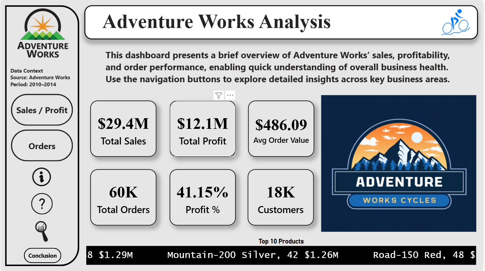
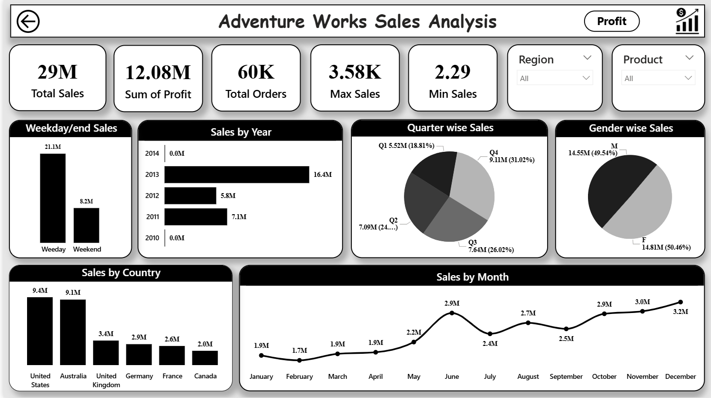
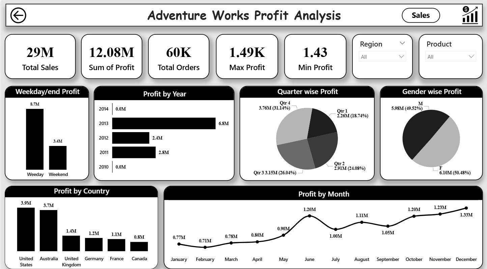
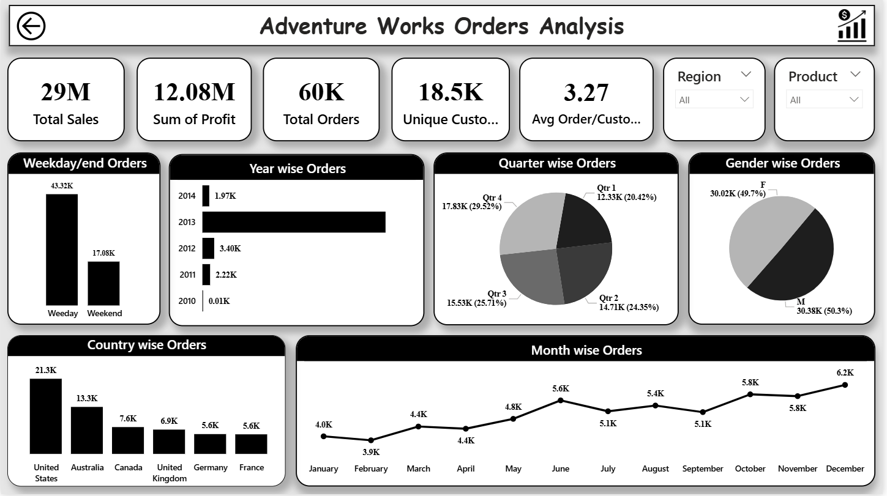
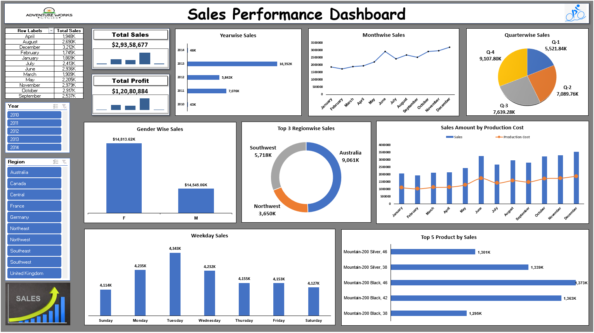
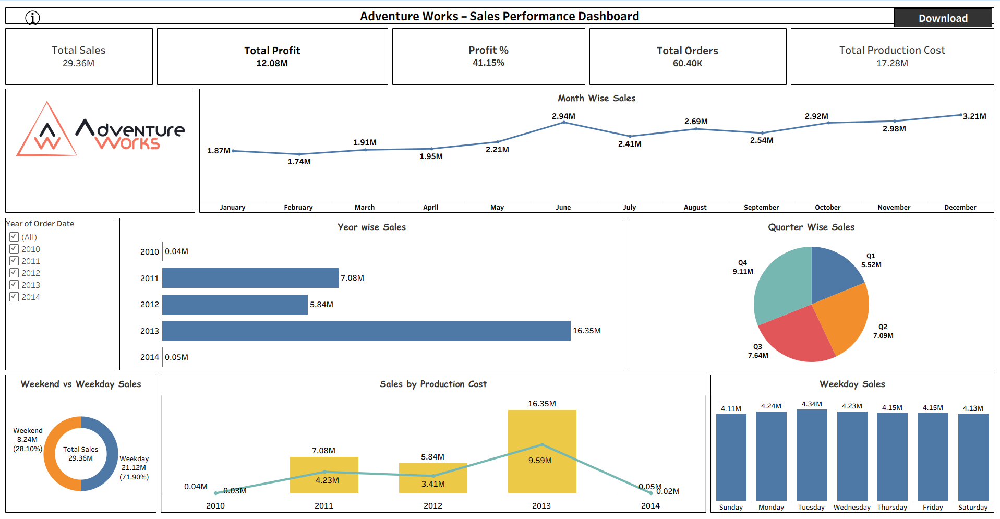
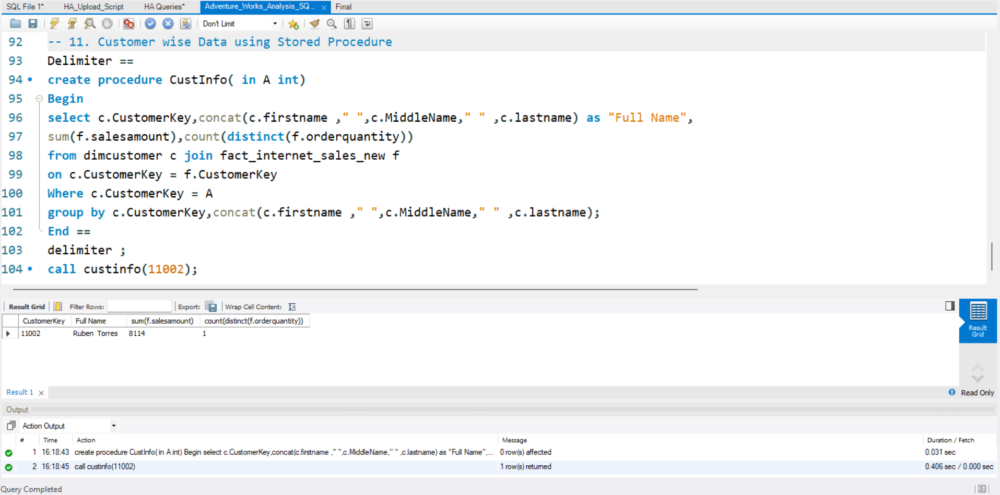
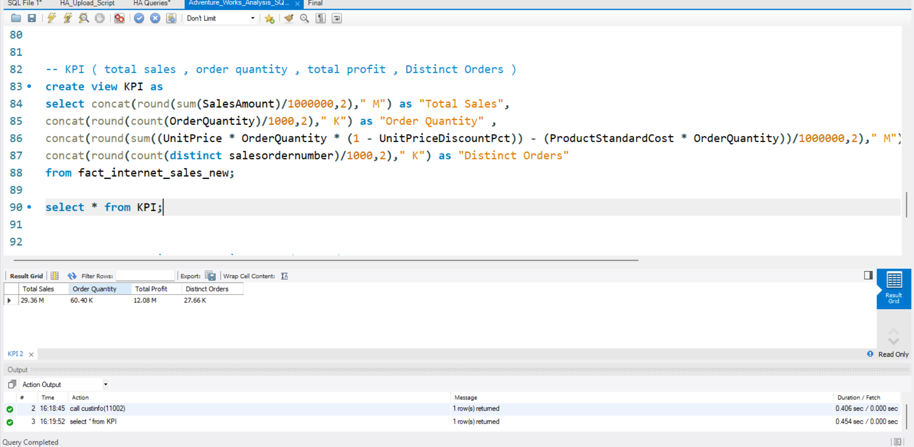
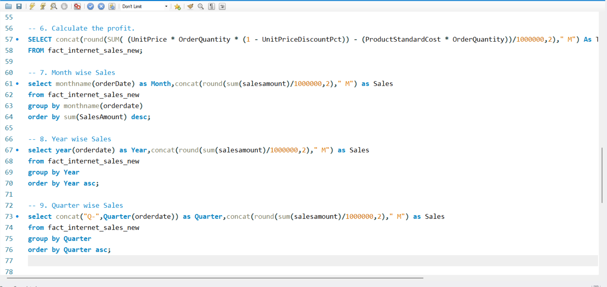
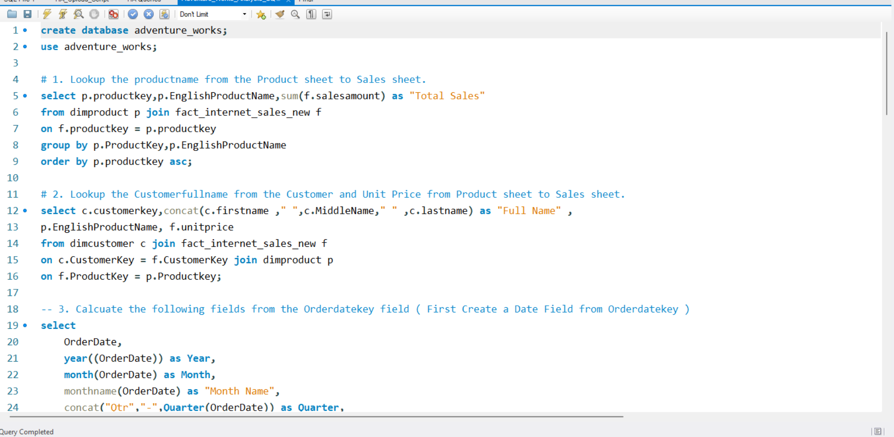

# Adventure Works Analysis



> **Internship Project** — AI Variant (ExcelR) | Virtual Internship  
> A complete end-to-end business analysis of Adventure Works Cycles covering Sales, Profit, and Orders using SQL, Power BI, Tableau, and Excel.

--- 

## Project Overview

Adventure Works Cycles is a fictional global bicycle manufacturing company used as a standard business intelligence dataset. This project performs a full analysis of their sales performance, profitability, and order trends across **2010–2014** using four industry-standard tools.

The goal was to answer key business questions:
- How are sales and profits trending over time?
- Which countries, regions, and products drive the most revenue?
- What are the order patterns by gender, quarter, and weekday vs weekend?
- What are the top-performing products and customer segments?

---

## Tools Used

| Tool | Purpose |
|------|---------|
| **MySQL** | Data extraction, KPI calculation, joins, views, stored procedures |
| **Power BI** | Interactive multi-page dashboard (Sales, Profit, Orders) |
| **Excel** | Pivot-based Sales Performance Dashboard |
| **Tableau** | Sales Performance Dashboard with trend analysis |

---

## Dashboards

### Power BI — 4-Page Interactive Dashboard

| Page | Preview |
|------|---------|
| **Home / Overview** |  |
| **Sales Analysis** |  |
| **Profit Analysis** |  |
| **Orders Analysis** |  |

---

### **Excel — Sales Performance Dashboard**


---

### **Tableau — Sales Performance Dashboard**


---

### **SQL — Query Screenshots**








---

## Key Business Insights

### Sales & Revenue
- **Total Sales: $29.4M** across 2010–2014 with peak performance in **2013 at $16.4M**
- **United States** is the top market at **$9.4M**, closely followed by **Australia at $9.1M**
- **June** records the highest monthly sales at **$2.9M**; **Q4 contributes 31%** of annual sales
- **Weekday sales ($21.1M)** are significantly higher than weekend sales ($8.2M)

### Profitability
- **Total Profit: $12.1M** with a healthy **Profit Margin of 41.15%**
- **2013** was the most profitable year at **$6.8M profit**
- **Q4** generates highest quarterly profit at **$3.76M (31.14%)**
- Female customers contribute slightly higher profit at **50.48%** vs Male at **49.52%**

### Orders & Customers
- **60K total orders** placed by **18.5K unique customers**
- Average of **3.27 orders per customer**
- **2013** saw the highest order volume; orders are nearly equal between male and female customers
- **Top products:** Mountain-200 Silver (46), Mountain-200 Black series dominate sales

### SQL Analysis Highlights
- Performed **11+ analytical queries** including multi-table JOINs across `dimcustomer`, `dimproduct`, and `fact_internet_sales_new`
- Created a **KPI VIEW** returning Total Sales (29.36M), Order Quantity (60.40K), Total Profit (12.08M), Distinct Orders (27.66K)
- Built a **Stored Procedure** (`CustInfo`) for individual customer sales lookup by CustomerKey
- Queries cover: profit calculation, month/year/quarter-wise sales, gender segmentation, country-wise breakdown

---

## Project Structure

```
01_Adventure-Works-Analysis/
│
├── README.md                        ← You are here
│
├── raw-data/
│   └── README.md                    ← Dataset description
│
├── powerbi/
│   ├── Adventure_Works.pbix         ← Power BI dashboard file
│   └── README.md
│
├── tableau/
│   ├── tableau_link.txt             ← Live Tableau Public link
│   └── README.md
│
├── sql/
│   ├── Adventure_Works_Analysis.sql ← All 11+ SQL queries
│   └── README.md
│
├── excel/
│   ├── Adventure_Works.xlsx         ← Excel Sales Performance Dashboard
│   └── README.md
│
└── Screenshots/
    ├── Dashboard1.png
    ├── Dashboard2.png
    ├── Dashboard4.png
    ├── Dashboard3.png
    ├── Dashboard5.png
    ├── Dashboard6.png
    ├── Dashboard7.png
    └── Dashboard8.png
```

---

## Dataset

- **Source:** Adventure Works — provided by ExcelR as part of virtual internship curriculum
- **Database:** `adventure_works` (MySQL)
- **Key Tables:** `fact_internet_sales_new`, `dimcustomer`, `dimproduct`
- **Period Covered:** 2010 – 2014
- **Records:** 60K+ order transactions across 6 countries

---

## 🔗 Links

| Platform | Link |
|---|---|
|  Tableau Public | [Live Dashboard](https://public.tableau.com/app/profile/piyush.dave4044/viz/projectgrpfile/Dashboard1) |
|  Excel (Google Drive) | [View Screenshots](https://drive.google.com/drive/folders/1fsse-OBr0OXT2qOWerVSyUCwO3KWHgUe?usp=sharing) |
|  Power BI Service | Available on request (license-restricted) |
|  Portfolio | [GitHub Portfolio](https://github.com/PiyushDave30/data-analyst-project-portfolio) |

---

## Author

**Piyush Dave**  
Data Analyst | SQL · Power BI · Tableau · Excel · Python  

[](https://www.linkedin.com/in/piyush-dave-0980a03a8)
[](https://public.tableau.com/app/profile/piyushdave/vizzes)
[](https://github.com/PiyushDave30)

---

> *This project was completed as part of a virtual internship at AI Variant through ExcelR's Data Analyst program.*
