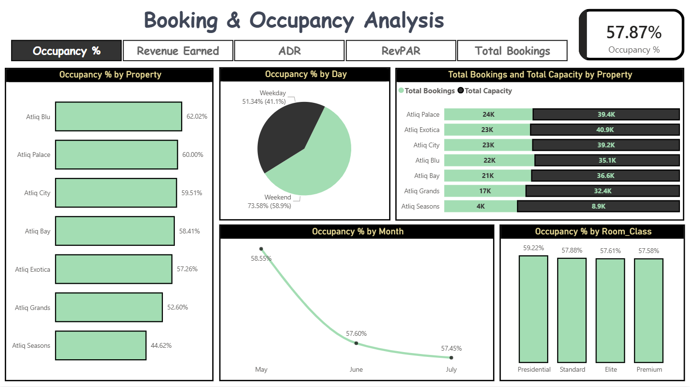

# 📊 Power BI Dashboard — Hospitality Analysis

This folder contains the 4-page Power BI dashboard for the Hospitality project.

---

## 📄 Files in This Folder

| File Name | Description |
|-----------|-------------|
| [Power BI Dashboard](Hospitality_Analysis.pbix) | Complete 4-page Power BI dashboard |
| [HA1](HA1.png) | Screenshot — Overview page |
| [HA2](HA2.png) | Screenshot — Revenue Analysis |
| [HA3](HA3.png) | Screenshot — Booking & Occupancy Analysis |
| [HA4](HA4.png) | Screenshot — Booking Analysis |
| [HA5](HA5.png) | Screenshot — Project Summary page |

---

## 📋 Dashboard Pages

### Page 1 — Overview

**KPI Cards:**
- Revenue Earned: **₹1.71bn** | Total Capacity: **232.6K**
- Occupancy %: **57.87%** | Total Bookings: **135K**
- Cancelled Bookings: **33.42K** | Cancellation %: **24.83%**

**Navigation buttons:** Overview → Revenue Analysis → Occupancy Analysis → Booking Analysis

**Revenue by City ticker:** Mumbai (668.64M), Bangalore (420.40M), Hyderabad (325.23M)

---

### Page 2 — Revenue Analysis

**Toggle:** Total Bookings / Revenue Earned / Total Capacity

| Visual | Details |
|--------|---------|
| KPI Cards | 135K bookings, 1.71bn revenue, 24.83% cancellation, 57.87% occupancy |
| Bookings by Status | Bar — Checked Out (94K), Cancelled (33K), No Show (7K) |
| Bookings by Platform | Bar — Others (55K), MakeYourTrip (27K), LogTrip (15K), Direct Online (13K) |
| Bookings by Category | Donut — Luxury 62.16% (84K) vs Business 37.84% (51K) |
| Bookings by Property | Bar — Atliq Palace (24K), Exotica (23K), City (23K), Blu (22K) |
| Bookings by City | Pie — Mumbai 32.29% (43K), Hyderabad 25.92% (35K), Bangalore 23% (32K), Delhi 18% (24K) |
| Bookings by Room Class | Bar — Elite (50K), Standard (38K), Premium (31K), Presidential (16K) |

---

### Page 3 — Booking & Occupancy Analysis

**Toggle:** Occupancy % / Revenue Earned / ADR / RevPAR / Total Bookings

| Visual | Details |
|--------|---------|
| Occupancy by Property | Bar — Atliq Blu (62.02%), Palace (60%), City (59.51%), Bay (58.41%), Exotica (57.26%), Grands (52.60%), Seasons (44.62%) |
| Occupancy by Day | Pie — Weekend 73.58% (58.9%) vs Weekday 51.34% (41.1%) |
| Bookings vs Capacity | Grouped bar per property |
| Occupancy by Month | Line — May (58.55%) → June (57.60%) → July (57.45%) declining trend |
| Occupancy by Room Class | Bar — Presidential (59.22%), Standard (57.88%), Elite (57.61%), Premium (57.58%) — nearly equal |

---

### Page 4 — Booking Analysis

**Toggle:** Total Cancelled / Checked Out / No Show Bookings

| Visual | Details |
|--------|---------|
| KPI Cards | 135K bookings, 57.87% occupancy, 24.83% cancellation, ADR 12.70K, DBRN 1.46K, DSRN 2.53K, DURN 1.03K, Realisation 70.1% |
| Cancelled by Room Class | Pie — Elite (36.97%), Standard (28.52%), Premium (22.76%), Presidential (11.75%) |
| Bookings by Status per City | Grouped bar — Mumbai (43K total, 11K cancelled) |
| Cancelled by Platform | Bar — Others (13.7K), MakeYourTrip (6.7K), LogTrip (3.6K) |
| Cancelled by Category | Donut — Luxury 61.86% (20.67K) vs Business 38.14% (12.75K) |

---

## 🛠️ Power BI Features Used
- **Star Schema** data model — fact_bookings + 3 dimension tables
- **Toggle buttons** — switch between metrics on each page
- **Page navigation** — Overview → Revenue → Occupancy → Booking
- **DAX Measures** — Occupancy %, ADR, RevPAR, Cancellation Rate, Realisation %
- **Slicers** — City, Room Class, Quarter, Category, Booking Status
- **Visuals** — Bar, Donut, Pie, Line, Grouped Bar, KPI Cards
- Green + black professional color theme

---

## 🔗 How to Open
1. Download `Hospitality_Analysis.pbix`
2. Open with **Microsoft Power BI Desktop**
3. Data is embedded — no external connections needed
