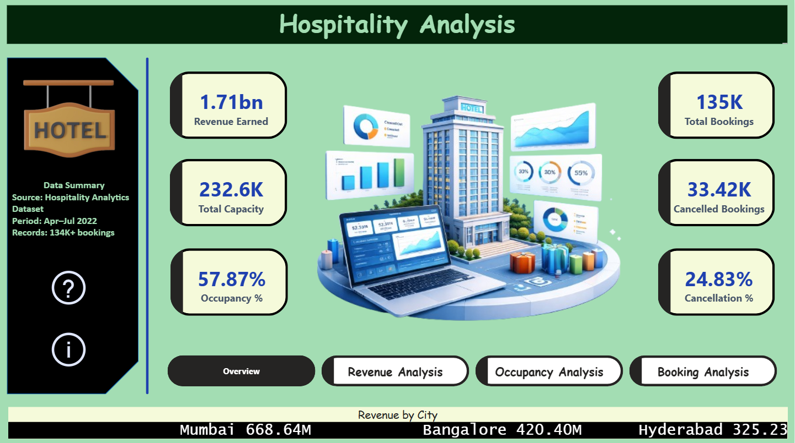
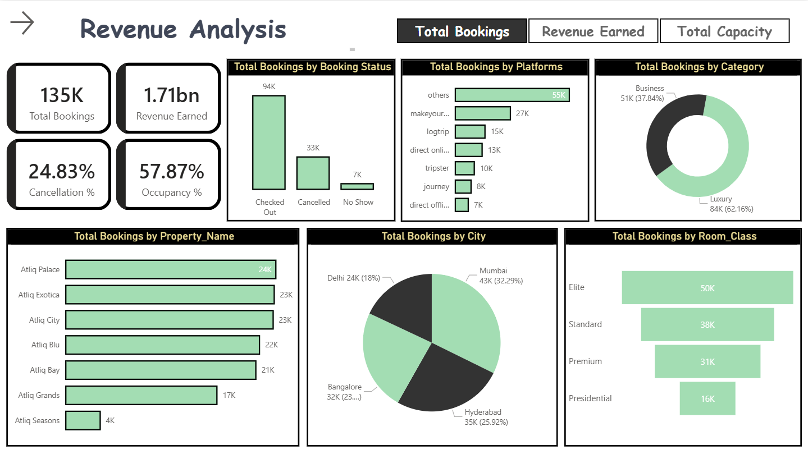
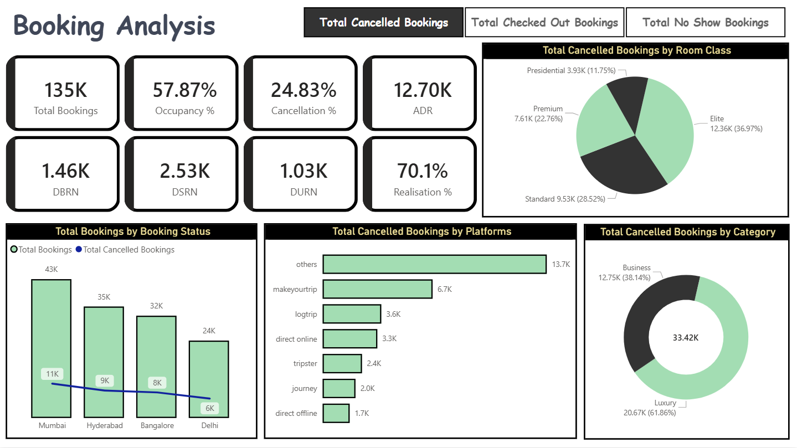
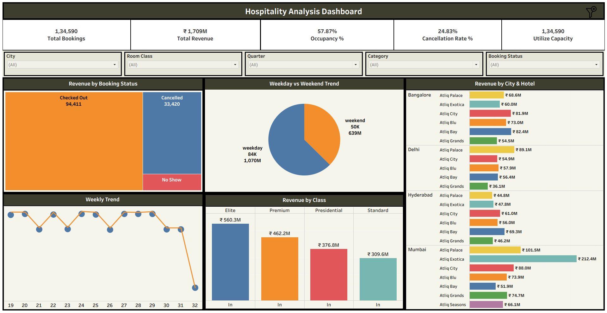
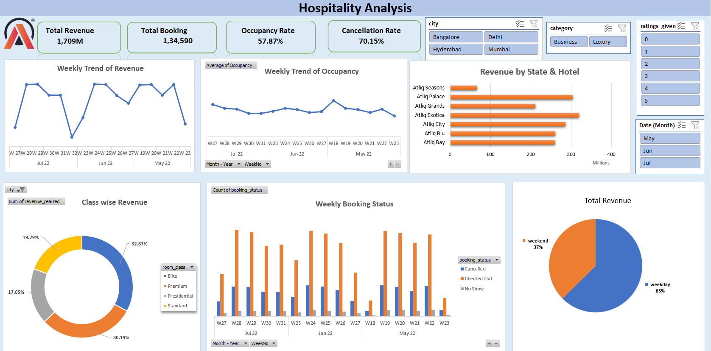
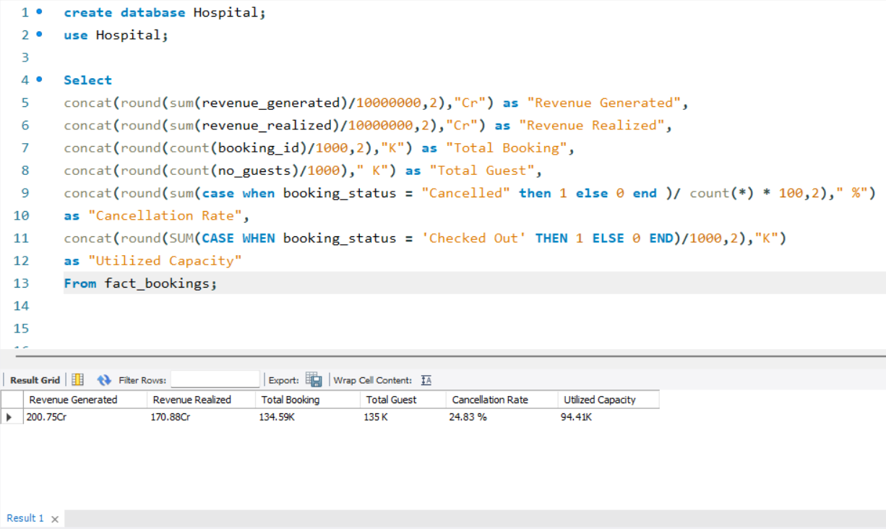
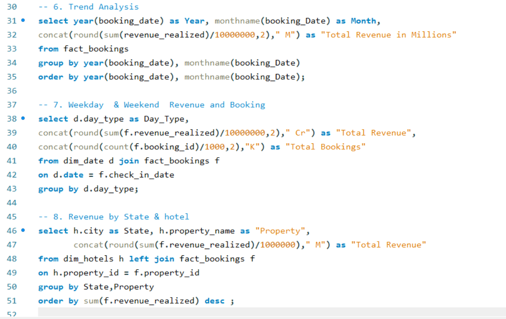
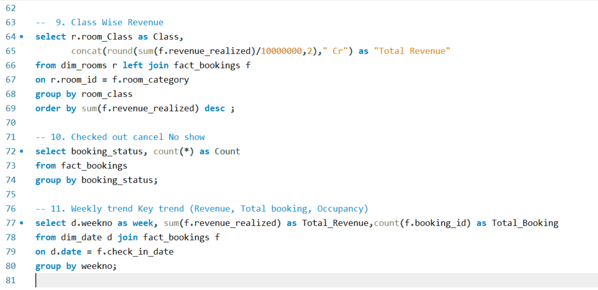

# Hospitality Analysis 



> **Internship Project** — AI Variant (ExcelR) | Virtual Internship  
> A complete end-to-end hospitality business analysis covering Revenue, Occupancy, Bookings, and Cancellations across 7 Atliq hotel properties in 4 Indian cities — using SQL, Power BI, Tableau, and Excel.
 
---

## Project Overview

This project analyzes hotel booking and revenue data for **Atliq Hotels**, a fictional luxury hotel chain operating across Mumbai, Bangalore, Hyderabad, and Delhi. The analysis covers the period **April to July 2022** with **134K+ booking records**.

The goal was to answer key business questions:
- Which cities and properties generate the most revenue?
- What is the occupancy rate across properties and room classes?
- How do cancellations impact overall revenue realization?
- What are the weekday vs weekend booking and revenue patterns?
- Which booking platforms and room categories perform best?

---

## Tools Used

| Tool | Purpose |
|------|---------|
| **MySQL** | KPI queries, revenue analysis, occupancy calculation, trend analysis |
| **Power BI** | 4-page interactive dashboard — Overview, Revenue, Occupancy, Booking Analysis |
| **Tableau** | Hospitality Analysis Dashboard with weekly trends and hotel-wise breakdown |
| **Excel** | Weekly trend analysis, booking status, class-wise revenue dashboard |

---

## Dashboards

### **Power BI — 4-Page Interactive Dashboard**

| Page | Preview |
|------|---------|
| **Overview** |  |
| **Revenue Analysis** |  |
| **Booking & Occupancy Analysis** |  |
| **Booking Analysis** |  |

---

### **Tableau — Hospitality Analysis Dashboard**


---

### **Excel — Hospitality Analysis Dashboard**


---

### **SQL — Query Screenshots**
| Query Set | Preview |
|-----------|---------|
| **KPI Master Query** |  |
| **Trend & Weekday Analysis** |  |
| **Class-wise & Weekly Revenue** |  |

---

## Key Business Insights

### Revenue
- **Total Revenue Generated: ₹200.75 Cr** | **Revenue Realized: ₹170.88 Cr (1.71bn)**
- **Mumbai** is the top revenue city at **₹668.64M**, followed by Bangalore (₹420.40M) and Hyderabad (₹325.23M)
- **Atliq Exotica Mumbai** is the single highest-earning property at **₹212.4M**
- **Elite room class** generates the highest revenue at **₹560.3M**, followed by Premium (₹462.2M)
- **Weekday bookings (84K)** generate **₹1,070M** vs Weekend bookings (50K) at **₹639M**

### Occupancy
- **Overall Occupancy Rate: 57.87%** across all properties
- **Atliq Blu** has the highest occupancy at **62.02%**, followed by Atliq Palace (60%)
- **Atliq Seasons** has the lowest occupancy at **44.62%** — opportunity for improvement
- **Weekend occupancy (73.58%)** is significantly higher than weekday (51.34%)
- Occupancy declined from **58.55% in May** to **57.45% in July**

### Bookings & Cancellations
- **Total Bookings: 1,34,590** | Checked Out: 94,411 | Cancelled: 33,420 | No Show: ~7K
- **Cancellation Rate: 24.83%** — highest cancellations from **Elite room class (36.97%)**
- **"Others" platform** drives the most bookings (55K), followed by MakeYourTrip (27K)
- **Luxury category** accounts for **62.16%** of total bookings vs Business at 37.84%
- **Mumbai** has the highest cancellations (11K), followed by Hyderabad (9K)

### SQL Analysis Highlights
- Master KPI query on `fact_bookings` returning Revenue Generated, Revenue Realized, Total Bookings, Cancellation Rate, and Utilized Capacity in a single query
- **11 analytical queries** covering: KPI summary, city-wise revenue, property performance, room class revenue, booking status breakdown, weekday/weekend analysis, weekly trend, trend analysis by month
- Multi-table JOINs across `fact_bookings`, `dim_hotels`, `dim_rooms`, `dim_date`
- Used `CASE WHEN` statements for dynamic cancellation rate and utilization capacity calculations

---

## Project Structure

```
02_Hospitality-Analysis/
│
├── README.md                          ← You are here
│
├── raw-data/
│   └── README.md                      ← Dataset description
│
├── powerbi/
│   ├── Hospitality_Analysis.pbix      ← Power BI dashboard file
│   └── README.md
│
├── tableau/
│   ├── tableau_link.txt               ← Live Tableau Public link
│   └── README.md
│
├── sql/
│   ├── Hospitality_Analysis.sql       ← All 11 SQL queries
│   └── README.md
│
├── excel/
│   ├── Hospitality_Analysis.xlsx      ← Excel dashboard
│   └── README.md
│
└── Screenshots/
    ├── HA1.png                        ← PBI Overview
    ├── HA2.png                        ← PBI Revenue Analysis
    ├── HA3.png                        ← PBI Occupancy Analysis
    ├── HA4.png                        ← PBI Booking Analysis
    ├── HA5.png                        ← PBI Project Summary
    ├── HA6.png                        ← Tableau Dashboard
    ├── HA7.png                        ← SQL KPI Query
    ├── HA8.png                        ← SQL Trend Analysis
    ├── HA9.png                        ← SQL Class & Weekly
    └── HA10.png                       ← Excel Dashboard
```

---

## Dataset

- **Source:** Hospitality Analytics Dataset — provided by ExcelR as part of virtual internship curriculum
- **Database:** `Hospital` (MySQL)
- **Key Tables:** `fact_bookings`, `dim_hotels`, `dim_rooms`, `dim_date`
- **Period Covered:** April – July 2022
- **Records:** 134K+ booking transactions
- **Properties:** 7 Atliq hotel properties across Mumbai, Bangalore, Hyderabad, Delhi

---

## Links

| Platform | Link |
|---|---|
|  Tableau Public | [Live Dashboard](https://public.tableau.com/app/profile/piyushdave/viz/Hospitality_Analytics_Dashboard_Tableau/Dashboard1) |
|  Excel (Google Drive) | [View Screenshot](https://drive.google.com/file/d/1GF4UckLsWO1jajwbDdU522knQKw4mdKu/view?usp=drive_link) |
|  Power BI Service | Available on request (license-restricted) |
|  Portfolio | [GitHub Portfolio](https://github.com/PiyushDave30/data-analyst-project-portfolio) |

---

## Author

**Piyush Dave**  
Data Analyst | SQL · Power BI · Tableau · Excel · Python

[](https://www.linkedin.com/in/piyush-dave-0980a03a8)
[](https://public.tableau.com/app/profile/piyushdave/vizzes)
[](https://github.com/PiyushDave30)

---

> *This project was completed as part of a virtual internship at AI Variant through ExcelR's Data Analyst program.*
