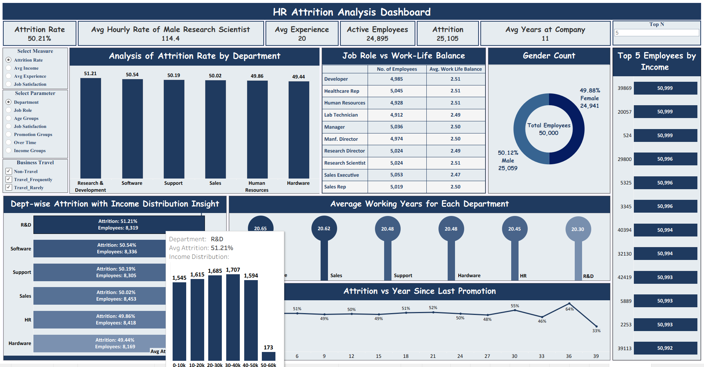
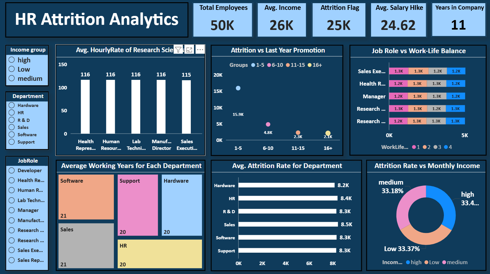
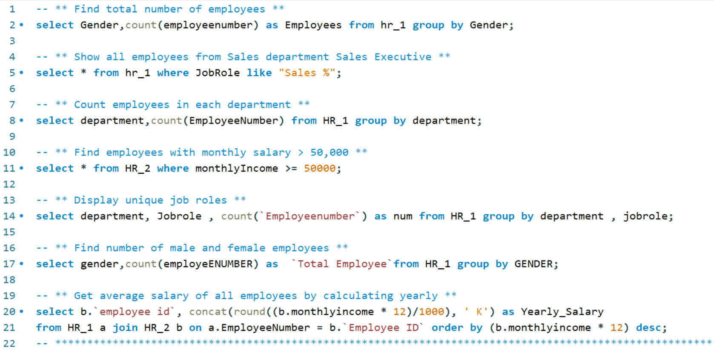
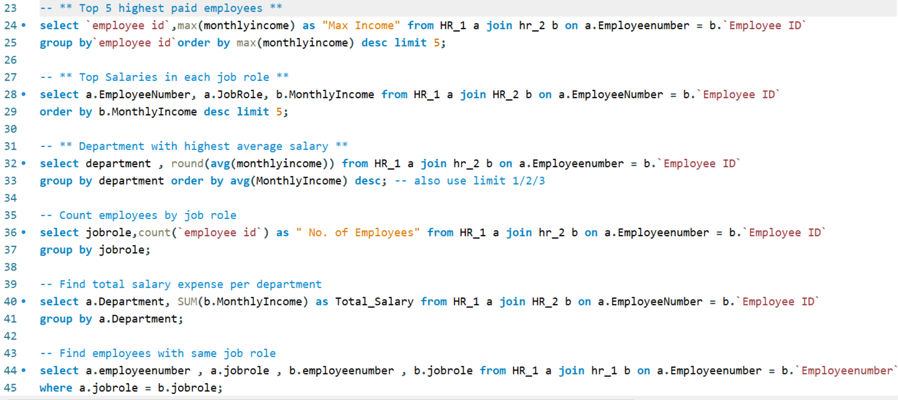
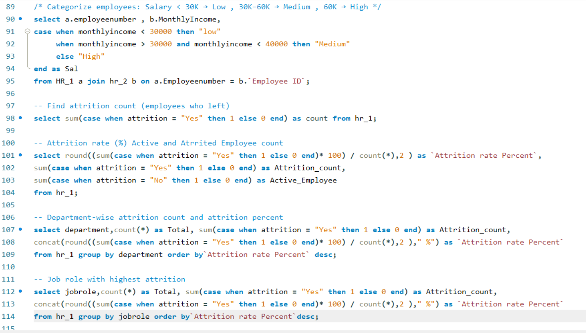
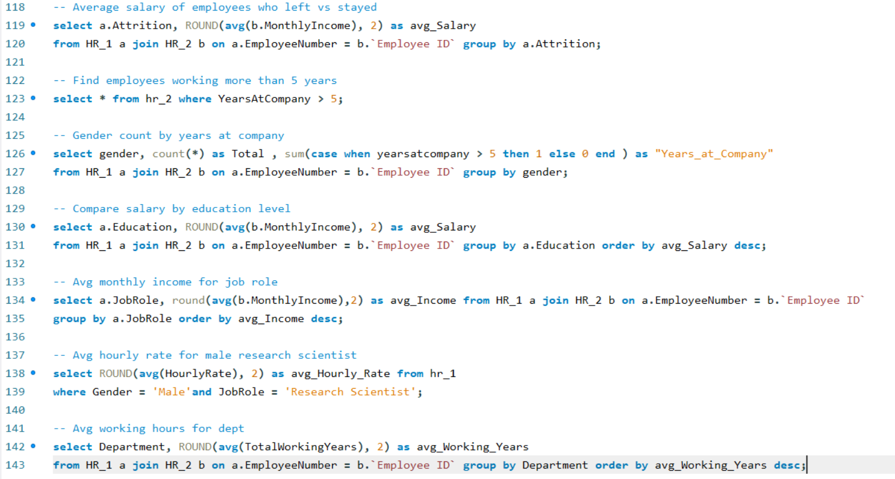

# HR Attrition Analysis Dashboard 



> **Internship Project** — AI Variant (ExcelR) | Virtual Internship  
> A complete HR analytics project analyzing employee attrition, salary distribution, department performance, and work-life balance across 50,000 employees using SQL, Power BI, Tableau, and Excel.

---

## Project Overview

This project analyzes HR data to identify key factors driving employee attrition in an organization with **50,000 employees** across 6 departments. The analysis helps HR teams understand:

- Which departments and job roles have the highest attrition?
- How does salary, promotion history, and work-life balance affect attrition?
- What is the gender distribution and income split across the organization?
- How do working years and overtime correlate with employee retention?

---

## Tools Used

| Tool | Purpose |
|------|---------|
| **MySQL** | Employee data queries, attrition analysis, salary segmentation, JOIN operations |
| **Power BI** | Single-page interactive HR Attrition Analysis Dashboard |
| **Tableau** | HR Attrition Analytics Dashboard with department and income filters |
| **Excel** | HR Attrition Dashboard *(in progress)* |

---

## Dashboards

### **Power BI — HR Attrition Analysis Dashboard**


---

### Tableau — HR Attrition Analytics Dashboard


---

### **SQL — Query Screenshots**

| Query Set | Preview |
|-----------|---------|
| **Gender, Department, Salary Queries** |  |
| **Top Salary, Dept Avg, Job Role Queries** |  |
| **Salary Categories, Attrition Rate Queries** |  |
| **Avg Salary Left vs Stayed, Working Years** |  |

---

## Key Business Insights

### Workforce Overview
- **Total Employees: 50,000** | Active: 24,895 | Attrited: 25,105
- **Overall Attrition Rate: 50.21%** — highest in R&D (51.21%), lowest in Hardware (49.44%)
- **Average Experience: 20 years** | Avg Years at Company: **11 years**
- **Gender Split:** Male 50.12% (25,059) | Female 49.88% (24,941) — nearly equal

### Department-wise Attrition
| Department | Attrition Rate | Employees |
|------------|---------------|-----------|
| **R&D** | 51.21% | 8,319 |
| **Software** | 50.54% | 8,336 |
| **Support** | 50.19% | 8,305 |
| **Sales** | 50.02% | 8,453 |
| **HR** | 49.86% | 8,418 |
| **Hardware** | 49.44% | 8,169 |

### Salary & Income
- **Avg Income: ₹26K** | Avg Salary Hike: **24.62%**
- **Avg Hourly Rate of Male Research Scientist: 114.4**
- Income groups are nearly evenly split — High (33.4%), Medium (33.18%), Low (33.37%)
- Income group distribution appears uniform across departments

### Work-Life Balance & Promotions
- All job roles show **avg work-life balance score of ~2.49–2.51** (out of 4)
- Attrition peaks at **64%** for employees who haven't been promoted in **36 years**
- Employees promoted within **1–5 years** show the highest active count (15.9K)
- Attrition drops significantly to **33%** for employees with **39+ years** since last promotion

### SQL Analysis Highlights
- **15+ queries** across `HR_1` and `HR_2` tables with JOIN operations
- Salary categorization using multi-level `CASE WHEN` (Low < 30K, Medium 30K–40K, High > 40K)
- Attrition rate calculation: `SUM(CASE WHEN attrition = "Yes" THEN 1 ELSE 0 END) * 100 / COUNT(*)`
- Department-wise and job-role-wise attrition percentages
- Avg salary comparison: employees who left vs stayed
- Avg hourly rate filtered by Gender + JobRole combination

---

## Project Structure

```
03_HR-Attrition-Analysis/
│
├── README.md                          ← You are here
│
├── raw-data/
│   └── README.md
│
├── powerbi/
│   ├── HR_Attrition_Analysis.pbix
│   └── README.md
│
├── tableau/
│   ├── tableau_link.txt               ← Live Tableau Public link
│   └── README.md
│
├── sql/
│   ├── HR_Attrition_Analysis.sql      ← All 15+ SQL queries
│   └── README.md
│
├── excel/
│   ├── HR_Attrition_Analysis.xlsx     ← Excel dashboard (in progress)
│   └── README.md
│
└── Screenshots/
    ├── HR1.png                        ← Power BI Dashboard
    ├── HR2.png                        ← SQL queries set 1
    ├── HR3.png                        ← SQL queries set 2
    ├── HR4.png                        ← SQL queries set 3
    ├── HR5.png                        ← SQL queries set 4
    └── HR_Tableau.png                 ← Tableau Dashboard
```

---

## Dataset

- **Source:** HR Analytics Dataset — provided by ExcelR as part of virtual internship curriculum
- **Tables:** `HR_1` (employee info), `HR_2` (salary and work data)
- **Total Records:** 50,000 employees
- **Key Fields:** EmployeeNumber, Department, JobRole, Gender, Attrition, MonthlyIncome, HourlyRate, YearsAtCompany, TotalWorkingYears, WorkLifeBalance, OverTime, YearsSinceLastPromotion

---

## Live Dashboard

| Platform | Link |
|----------|------|
| Tableau Public | [View Live HR Attrition Dashboard](https://public.tableau.com/app/profile/piyushdave/viz/HR_Analytics_Tableau_17765068172250/Dashboard) |

---

## Author

**Piyush Dave**  
Data Analyst | SQL · Power BI · Tableau · Excel · Python

[](https://www.linkedin.com/in/piyush-dave-0980a03a8)
[](https://public.tableau.com/app/profile/piyushdave/vizzes)
[](https://github.com/PiyushDave30)

---

> *This project was completed as part of a virtual internship at AI Variant through ExcelR's Data Analyst program.*
