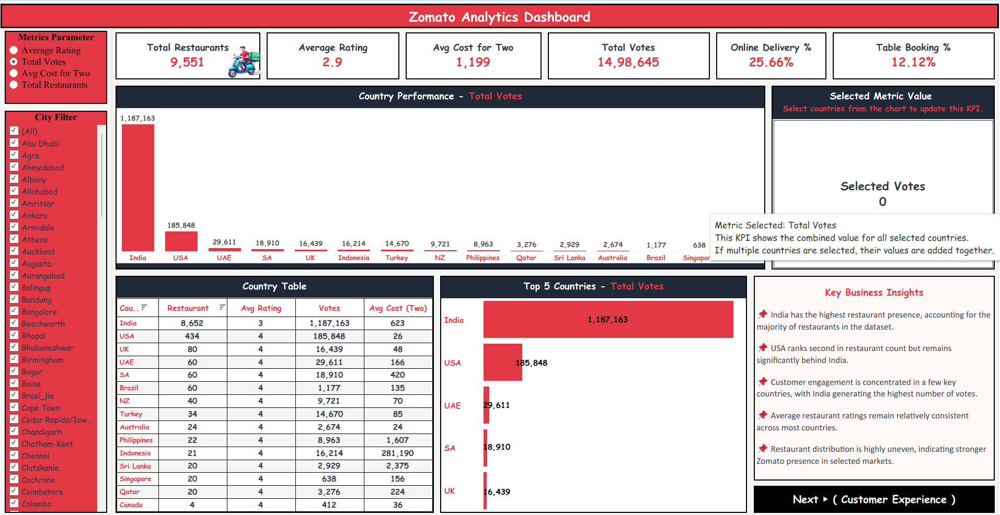
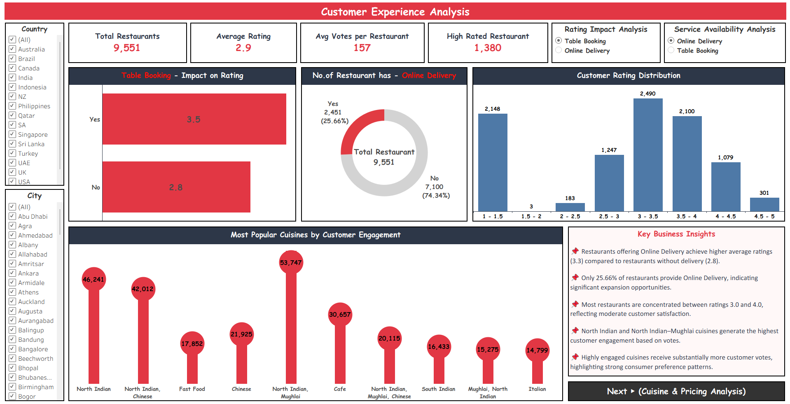

# 📈 Tableau Dashboard — Zomato Sales & Rating Analysis

This folder contains the 3-page Tableau dashboard for the Zomato project.

---

## 📄 Files in This Folder

| File Name | Description |
|-----------|-------------|
| [Tableau Zomato](tableau_link.txt) | Live Tableau Public dashboard URL |
| [Z_1](Z_1.png) | Screenshot — Page 1: Executive Overview |
| [Z_2](Z_2.png) | Screenshot — Page 2: Customer Experience Analysis |
| [Z_3](Z_3.png) | Screenshot — Page 3: Cuisine & Pricing Analysis |

---

## 🌐 Live Dashboard

👉 **[Click here to view the live 3-Page Tableau Dashboard](https://public.tableau.com/app/profile/piyushdave/viz/ZomatoGlobalAnalysis/ExecutiveOverview)**

---

## 📊 Dashboard Pages

### Page 1 — Executive Overview

**KPI Banner:**
| Metric | Value |
|--------|-------|
| Total Restaurants | 9,551 |
| Average Rating | 2.9 |
| Avg Cost for Two | 1,199 |
| Total Votes | 14,98,645 |
| Online Delivery % | 25.66% |
| Table Booking % | 12.12% |

**Visuals:**
| Visual | Details |
|--------|---------|
| Country Performance Bar | India leads (11,87,163 votes) → USA (1,85,848) → UAE (29,611) |
| Selected Metric Value KPI | Dynamic KPI — updates when country selected from chart |
| Country Table | All 15 countries with restaurants, avg rating, votes, avg cost |
| Top 5 Countries Bar | India (11,87,163), USA (1,85,848), UAE (29,611), SA (18,910), UK (16,439) |
| Key Business Insights | 5 bullet point insights panel |
| Navigation | Next → Customer Experience button |

**Filters:** City filter (141 cities) + Metrics Parameter toggle (Avg Rating / Total Votes / Avg Cost / Total Restaurants)

---

### Page 2 — Customer Experience Analysis

**KPI Banner:**
| Metric | Value |
|--------|-------|
| Total Restaurants | 9,551 |
| Average Rating | 2.9 |
| Avg Votes per Restaurant | 157 |
| High Rated Restaurants | 1,380 |

**Visuals:**
| Visual | Details |
|--------|---------|
| Table Booking Impact Bar | With booking: **3.5** vs Without: **2.8** |
| Online Delivery Donut | Yes: 2,451 (25.66%) vs No: 7,100 (74.34%) |
| Customer Rating Distribution | Bar chart — 3.0–3.5 band has most restaurants (2,490) |
| Most Popular Cuisines Lollipop | North Indian Mughlai leads with **53,747 votes** |
| Key Business Insights | 5 insight bullets |
| Navigation | Next → Cuisine & Pricing button |

**Filters:** Country + City filter | Rating Impact toggle (Table Booking / Online Delivery) | Service Availability toggle (Online Delivery / Table Booking)

---

### Page 3 — Cuisine & Pricing Analysis

**KPI Banner:**
| Metric | Value |
|--------|-------|
| Total Cuisines | 1,825 |
| Average Rating | 2.9 |
| Avg Cost for Two | 1,199 |
| Most Popular Price Range | Cheap |
| Top Cuisine | North Indian |

**Visuals:**
| Visual | Details |
|--------|---------|
| Top 10 Cuisines Lollipop | North Indian (936), North Indian + Chinese (511), Fast Food (354), Chinese (354) |
| Restaurant Distribution by Price Range | Cheap (4,444), Affordable (3,113), Expensive (1,408), Luxury (586) |
| Avg Rating by Price Range | Cheap (2.38) → Affordable (3.07) → Expensive (3.71) → Luxury (3.84) |
| Customer Ratings across Top Cuisines | North Indian (2.1), North Indian Mughlai (3.0), Cafe (3.0) |
| Cuisine & Pricing Insights | 5 insight bullets |
| Navigation | Back → Executive Overview button |

---

## 🛠️ Tableau Features Used
- **3-page navigation** — Next/Back buttons between pages
- **Dynamic parameter toggle** — switch metrics (Avg Rating/Total Votes/Avg Cost/Total Restaurants)
- **Dynamic KPI** — Selected Metric Value updates on country click
- **City + Country multi-select filters**
- **Rating Impact toggle** — Table Booking vs Online Delivery
- **Lollipop charts** — Top 10 Cuisines, Most Popular Cuisines by Engagement
- **Bar charts, donut chart, distribution chart, country table**
- **Key Business Insights panel** on every page
- Red + black + white brand color theme matching Zomato
- Published on **Tableau Public** with specific dashboard URL

---

## 💡 Key Insights Summary
- India has 90%+ of all restaurants in dataset
- Table booking restaurants rate **0.7 points higher** than non-booking
- Only 25.66% have online delivery — **expansion opportunity**
- Higher price = better rating — Luxury (3.84) vs Cheap (2.38)
- North Indian cuisine dominates in both count (936) and engagement (53,747 votes)
- Most restaurants clustered in 3.0–3.5 rating band
