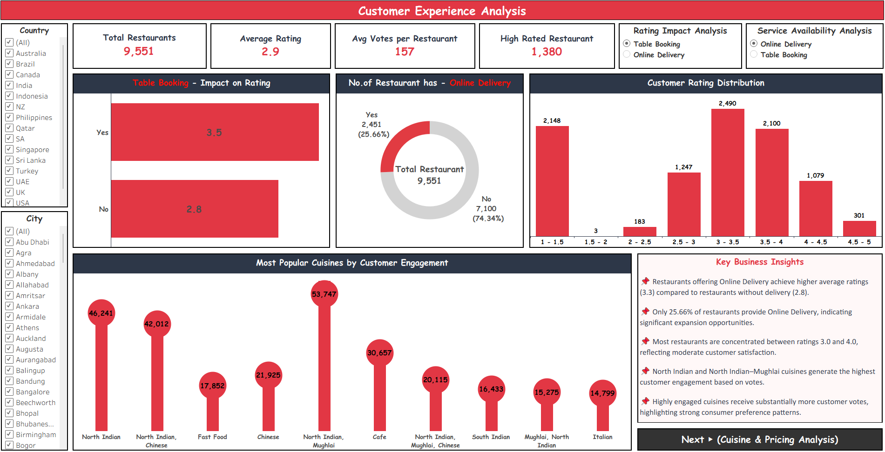
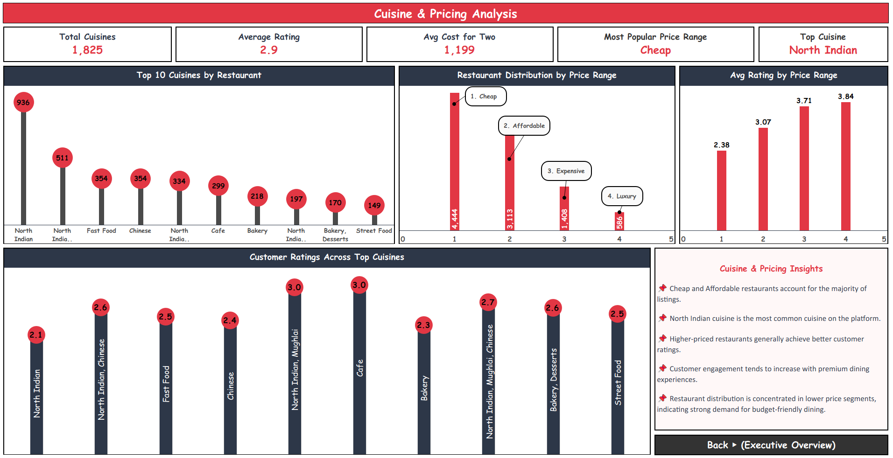

# Zomato Sales & Rating Analysis 


> **Self-Made Project** | Resume Project  
> An in-depth analysis of Zomato's global restaurant data covering 9,551 restaurants across 15 countries and 141 cities — using advanced SQL queries and a 3-page interactive Tableau dashboard with Key Business Insights on every page.

---

## Project Overview

This project analyzes Zomato's restaurant dataset to uncover insights about restaurant performance, customer preferences, cuisine trends, pricing patterns, and delivery/booking behavior across global markets.

**Key business questions answered:**
- Which countries and cities dominate Zomato's restaurant presence?
- How do online delivery and table booking affect customer ratings?
- What cuisines are most popular and most engaging for customers?
- Which price ranges have the most restaurants and best ratings?
- What is the relationship between votes, ratings, and restaurant quality?

---

## 🛠️ Tools Used

| Tool | Purpose |
|------|---------|
| **MySQL** | 25+ advanced queries — KPI views, stored procedures, window functions, segmentation |
| **Tableau** | 3-page interactive Tableau dashboard published on Tableau Public |

---

## 📊 Tableau Dashboard — 3 Pages

### 🌐 Live Dashboard
👉 **[Click here to view the live Tableau Dashboard](https://public.tableau.com/app/profile/piyushdave/viz/ZomatoGlobalAnalysis/ExecutiveOverview)**

---

### Page 1 — Executive Overview


### Page 2 — Customer Experience Analysis


### Page 3 — Cuisine & Pricing Analysis


---

### SQL — Query Screenshots

| Query Set | Preview |
|-----------|---------|
| KPI View — 9 metrics in one query |  |
| City Analysis + Revenue Analysis |  |
| Cuisine + Customer Behaviour Analysis |  |
| Services Offered + Window Functions |  |
| Delivery & Booking Trend Analysis |  |
| Advanced Stored Procedure |  |

---

## 🔑 Key Business Insights

### 📊 Restaurant Overview (from KPI View)
- **Total Restaurants: 9,551** across **15 countries** and **141 cities**
- **Total Cuisines: 1,825** unique cuisine types
- **Average Rating: 2.9** out of 5
- **Avg Cost for Two: ₹1,199**
- **Total Votes: 14,98,645**
- **Online Delivery: 25.66%** (2,451 restaurants)
- **Table Booking: 12.12%** (1,158 restaurants)

### 🌍 Country Insights (Page 1)
- **India dominates** with **8,652 restaurants** and **11,87,163 votes** — far ahead of all countries
- **USA** is second with 434 restaurants and 1,85,848 votes
- **Indonesia** has highest avg cost for two (2,81,190 local currency)
- Most countries maintain avg rating of **4** — consistent quality
- Top 5 by votes: India (11,87,163) → USA (1,85,848) → UAE (29,611) → SA (18,910) → UK (16,439)

### ⭐ Customer Experience Insights (Page 2)
- **Restaurants WITH table booking** avg rating: **3.5** vs WITHOUT: **2.8** — table booking = quality signal
- **Online Delivery** restaurants get higher ratings (3.3) vs without (2.8)
- Only **25.66%** restaurants have online delivery — **significant expansion opportunity**
- Most restaurants concentrated between **rating 3.0–4.0** — moderate customer satisfaction
- **2,490 restaurants** fall in 3.0–3.5 rating band — largest group
- **North Indian Mughlai** is most engaging cuisine with **53,747 votes**
- **Avg votes per restaurant: 157** | **High rated restaurants: 1,380**

### 🍽️ Cuisine & Pricing Insights (Page 3)
- **North Indian** is the most common cuisine — **936 restaurants**
- **Cheap price range** (₹1) has the most restaurants: **4,444**
- **Luxury restaurants** (₹4) have the highest avg rating: **3.84**
- Higher price = better rating — clear positive correlation
- **North Indian Mughlai** and **Cafe** cuisines have highest customer ratings (3.0)
- **Cheap + Affordable** price ranges account for majority of all listings

---

## 📁 Project Structure

```
04_Zomato-Sales-Rating-Analysis/
│
├── README.md                          ← You are here
│
├── raw-data/
│   └── README.md
│
├── sql/
│   ├── Zomato_Analysis.sql            ← All 25+ SQL queries
│   └── README.md
│
├── tableau/
│   ├── tableau_link.txt               ← Live Tableau Public link
│   └── README.md
│
└── Screenshots/
    ├── Z_1.png                        ← Tableau Page 1 — Executive Overview
    ├── Z_2.png                        ← Tableau Page 2 — Customer Experience
    ├── Z_3.png                        ← Tableau Page 3 — Cuisine & Pricing
    ├── Z1.png                         ← SQL: Stored Procedure
    ├── Z2.png                         ← SQL: KPI View + output
    ├── Z3.png                         ← SQL: Delivery & Booking Trend
    ├── Z4.png                         ← SQL: Cuisine + Customer Behaviour
    ├── Z5.png                         ← SQL: City + Revenue Analysis
    └── Z6.png                         ← SQL: Window Functions + Services
```

---

## 📂 Dataset

- **Source:** Zomato Restaurant Dataset (publicly available)
- **Table:** `zomato` (MySQL)
- **Total Records:** 9,551 restaurants
- **Coverage:** 15 countries, 141 cities
- **Key Fields:** RestaurantID, City, Cuisines, Rating, Votes, Average_Cost_for_two, Has_Online_Delivery, Has_Table_Booking, Price_range, CountryCode, Is_delivering_now

---

## 🌐 Live Dashboard

| Platform | Link |
|----------|------|
| Tableau Public | [View Live Zomato 3-Page Dashboard](https://public.tableau.com/app/profile/piyushdave/viz/ZomatoGlobalAnalysis/ExecutiveOverview) |

---

## 👤 Author

**Piyush Dave**  
Data Analyst | SQL · Power BI · Tableau · Excel · Python

[](https://www.linkedin.com/in/piyush-dave-0980a03a8)
[](https://public.tableau.com/app/profile/piyushdave/vizzes)
[](https://github.com/PiyushDave30)
