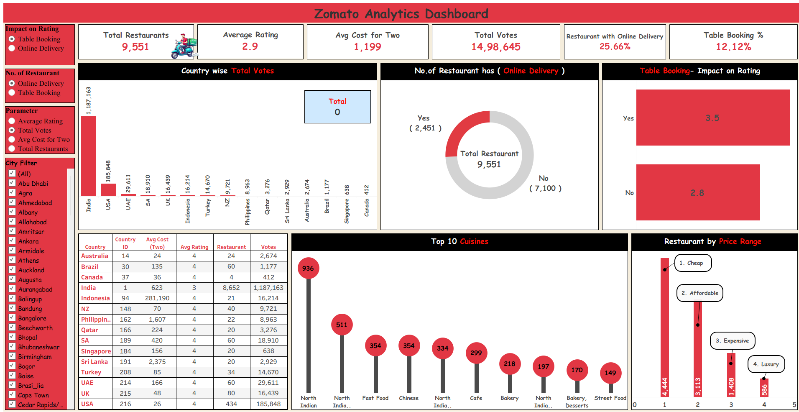
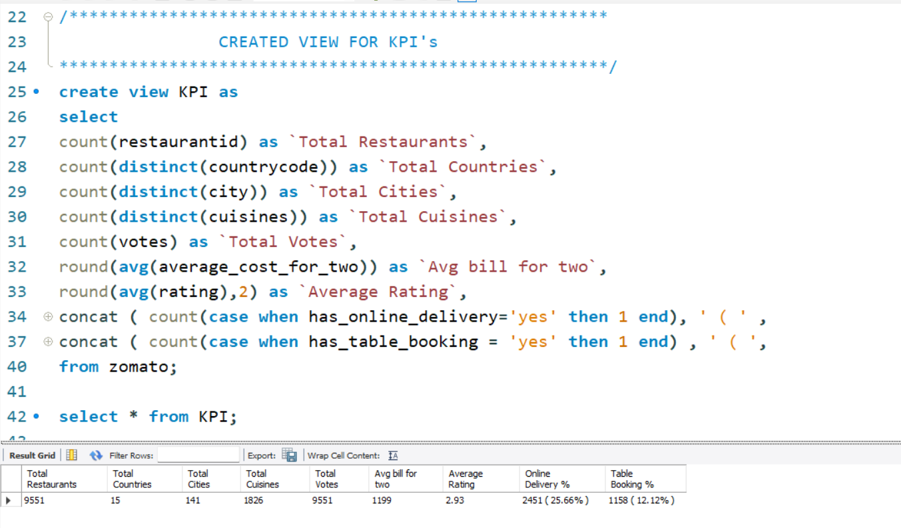
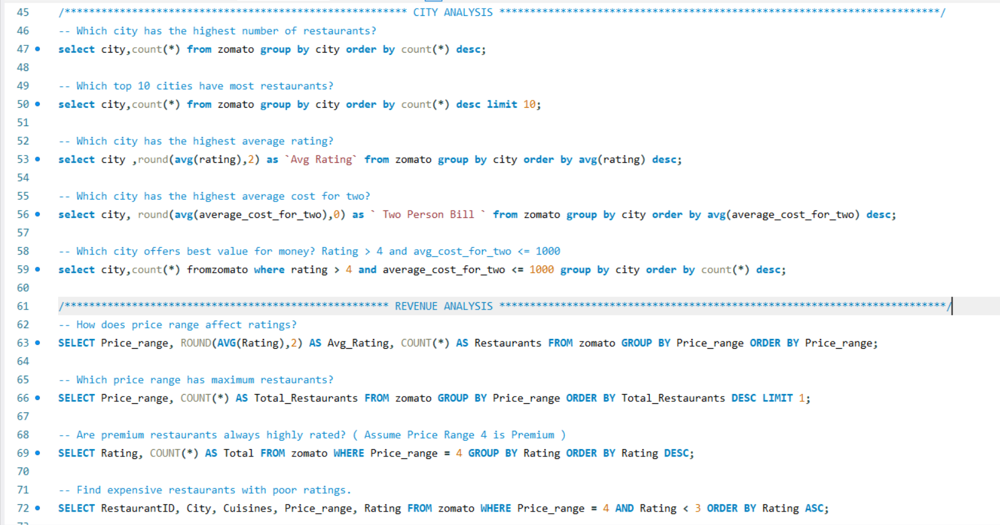
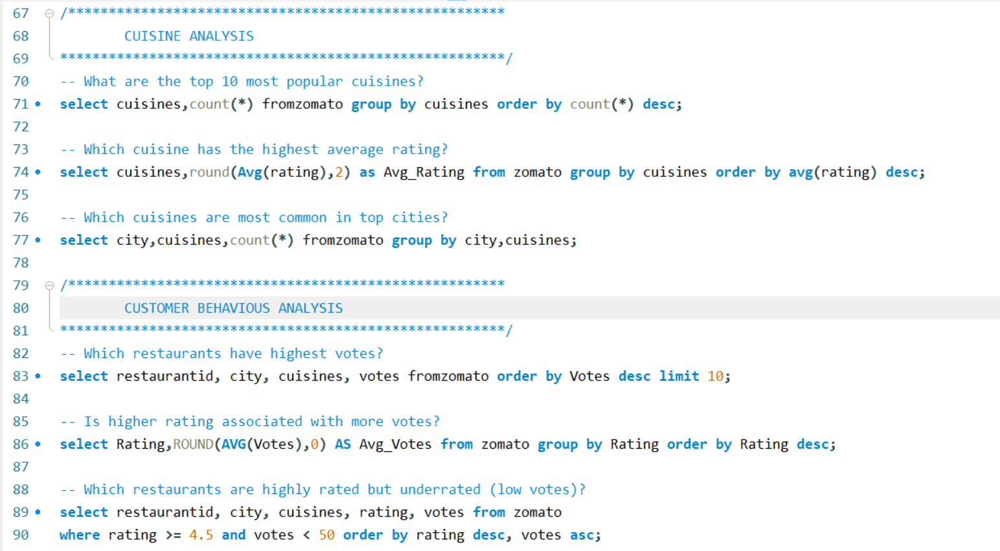
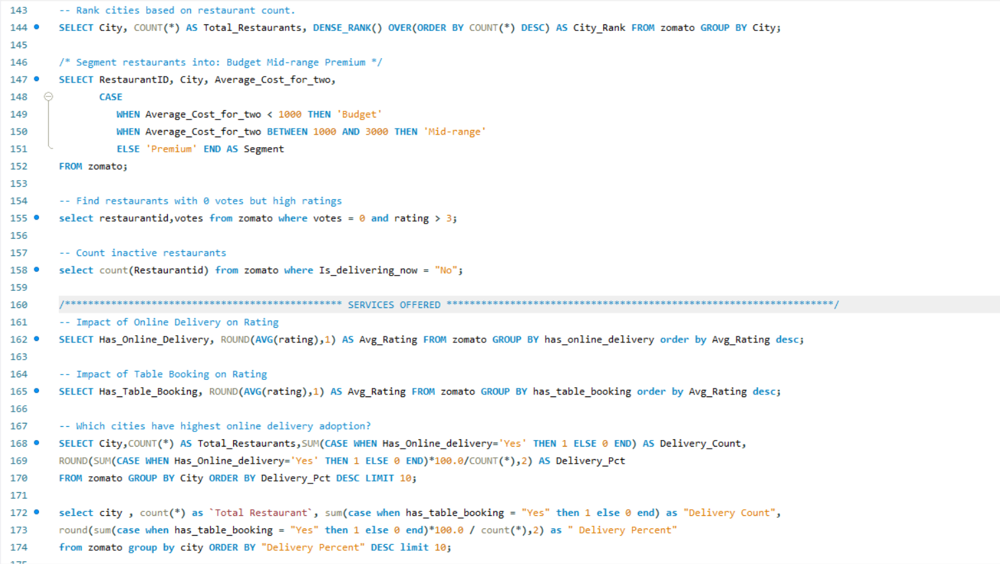
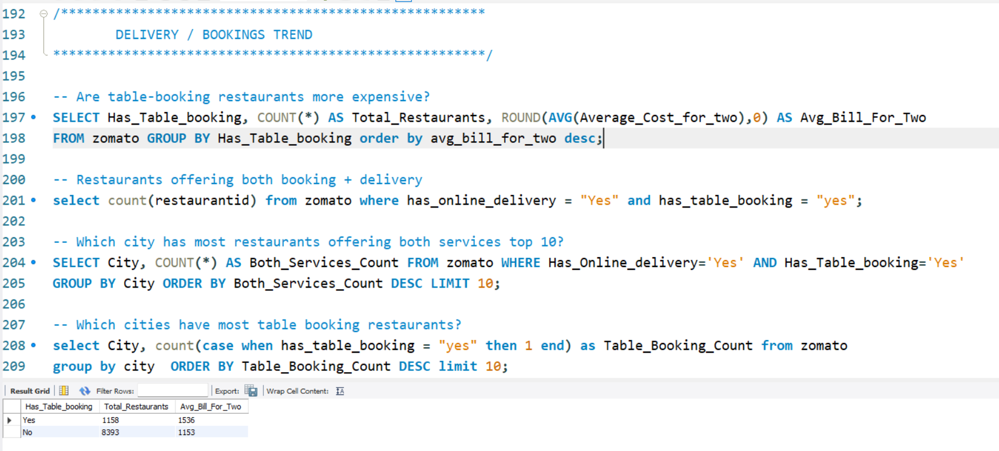
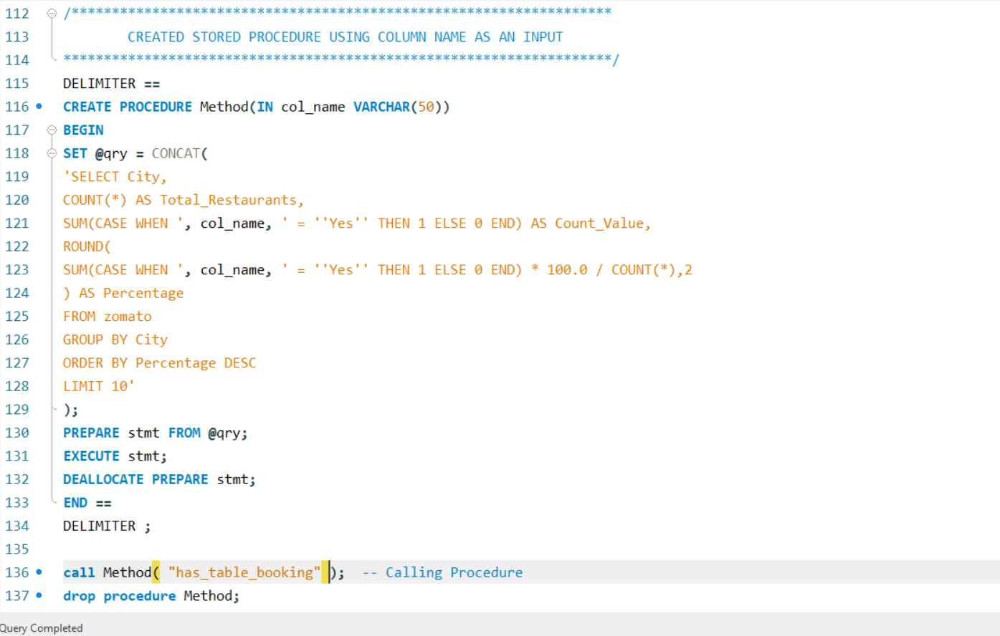

# Zomato Sales & Rating Analysis 🍽️



> **Self-Made Project** | Resume Project  
> An in-depth analysis of Zomato's global restaurant data covering 9,551 restaurants across 15 countries and 141 cities — using advanced SQL queries and an interactive Tableau dashboard.

---

## 📌 Project Overview

This project analyzes Zomato's restaurant dataset to uncover insights about restaurant performance, customer preferences, cuisine trends, pricing patterns, and delivery/booking behavior across global markets.

**Key business questions answered:**
- Which cities and countries have the most restaurants and highest ratings?
- How do online delivery and table booking affect restaurant ratings?
- What cuisines are most popular and highest rated?
- Which price ranges offer the best value for money?
- What is the relationship between votes, ratings, and restaurant success?

---

## 🛠️ Tools Used

| Tool | Purpose |
|------|---------|
| **MySQL** | 25+ advanced queries — KPI views, stored procedures, window functions, segmentation |
| **Tableau** | Interactive Zomato Analytics Dashboard with filters and dynamic parameters |

---

## 📊 Dashboards

### Tableau — Zomato Analytics Dashboard


---

### SQL — Query Screenshots

| Query Set | Preview |
|-----------|---------|
| **KPI View — 9 metrics in one query** |  |
| **City Analysis + Revenue Analysis** |  |
| **Cuisine + Customer Behaviour Analysis** |  |
| **Services Offered + Window Functions** |  |
| **Delivery & Booking Trend Analysis** |  |
| **Advanced Stored Procedure** |  |

---

## 🔑 Key Business Insights

### Restaurant Overview (from KPI View)
- **Total Restaurants: 9,551** across **15 countries** and **141 cities**
- **Total Cuisines: 1,826** unique cuisine types available
- **Average Rating: 2.93** out of 5 across all restaurants
- **Avg Cost for Two: ₹1,199**
- **Total Votes: 14,98,645**
- **Online Delivery: 25.66%** of restaurants (2,451 out of 9,551)
- **Table Booking: 12.12%** of restaurants (1,158 out of 9,551)

### Country & City Insights
- **India dominates** with 8,652 restaurants and 11,87,163 votes — far ahead of all other countries
- **USA** is second with 434 restaurants and 1,85,848 votes
- **Indonesia** has the highest avg cost for two at 2,81,190 (local currency)
- Top 10 cities by restaurant count extracted with LIMIT queries

### Rating & Delivery Insights
- **Restaurants WITH table booking** avg rating: **3.5** vs WITHOUT: **2.8** — table booking = higher quality signal
- **Online delivery** restaurants show higher avg ratings than non-delivery
- Higher-rated restaurants tend to get significantly more votes
- Restaurants with **0 votes but rating > 3** identified as underrated hidden gems

### Cuisine Insights
- **North Indian** is the most popular cuisine with **936 restaurants**
- Top 10 cuisines: North Indian (936), North Indian + others (511), Fast Food (354), Chinese (354), North Indian + Chinese (334), Cafe (299), Bakery (218), North Indian + Desserts (197), Bakery + Desserts (170), Street Food (149)

### Price Range & Revenue
- **Price Range 1 (Cheap)** has the most restaurants — **4,444**
- **Price Range 2 (Affordable):** 3,113 | **Price Range 3 (Expensive):** 1,408 | **Price Range 4 (Luxury):** 586
- Table booking restaurants have significantly higher avg bill (1,536 vs 1,153 for non-booking)
- Premium restaurants (Price Range 4) analyzed for rating distribution

### SQL Analysis Highlights
- **KPI VIEW** returning 9 metrics in a single query
- **Advanced Stored Procedure** `Method(col_name VARCHAR)` — accepts any column as dynamic input using `PREPARE`/`EXECUTE`/`DEALLOCATE`
- **Window Function** `DENSE_RANK() OVER(ORDER BY COUNT(*) DESC)` for city ranking
- **Restaurant Segmentation** — Budget (<1000), Mid-range (1000–3000), Premium (>3000) using `CASE WHEN`
- **25+ queries** organized into 6 sections: KPI, City Analysis, Revenue Analysis, Cuisine Analysis, Customer Behaviour, Services Offered + Delivery Trends

---

## 📁 Project Structure

```
04_Zomato-Sales-Rating-Analysis/
│
├── README.md                          ← You are here
│
├── raw-data/
│   └── README.md
│
├── sql/
│   ├── Zomato_Analysis.sql            ← All 25+ SQL queries
│   └── README.md
│
├── tableau/
│   ├── tableau_link.txt               ← Live Tableau Public link
│   └── README.md
│
└── Screenshots/
    ├── Z1.png                         ← SQL: Stored Procedure
    ├── Z2.png                         ← SQL: KPI View + output
    ├── Z3.png                         ← SQL: Delivery & Booking Trend
    ├── Z4.png                         ← SQL: Cuisine + Customer Behaviour
    ├── Z5.png                         ← SQL: City + Revenue Analysis
    ├── Z6.png                         ← SQL: Window Functions + Services
    └── Z7.png                         ← Tableau Dashboard
```

---

## 📂 Dataset

- **Source:** Zomato Restaurant Dataset (publicly available)
- **Table:** `zomato`
- **Total Records:** 9,551 restaurants
- **Coverage:** 15 countries, 141 cities
- **Key Fields:** RestaurantID, City, Cuisines, Rating, Votes, Average_Cost_for_two, Has_Online_Delivery, Has_Table_Booking, Price_range, CountryCode, Is_delivering_now

---

## 🌐 Live Dashboard

| Platform | Link |
|----------|------|
| Tableau Public | [View Live Zomato Dashboard](https://public.tableau.com/app/profile/piyushdave/viz/ZomatoTableauDB/Dashboard1) |

---

## 👤 Author

**Piyush Dave**  
Data Analyst | SQL · Power BI · Tableau · Excel · Python

[](https://www.linkedin.com/in/piyush-dave-0980a03a8)
[](https://public.tableau.com/app/profile/piyushdave/vizzes)
[](https://github.com/PiyushDave30)
