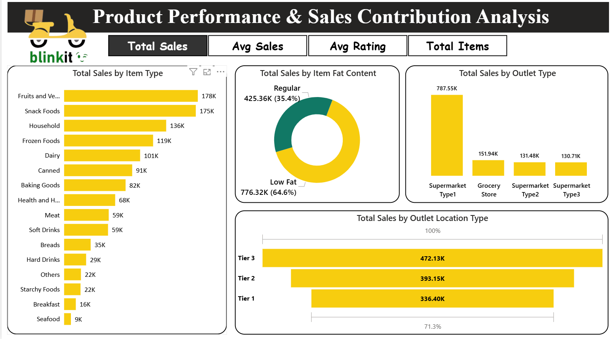

# 📊 Power BI Dashboard — Blinkit Sales Performance

This folder contains the Power BI dashboard file for the Blinkit project.

---

## 📄 Files in This Folder

| File Name | Description |
|-----------|-------------|
| [Blinkit Analysis PowerBI](BlinkIT_Sales_Analysis_Project.pbix) | Complete 5-page Power BI dashboard |
| [Dashboard PDF](BlinkIT%20Dashboard.pdf) | Complete Dashboard in the form of PDF |
| [B1](B1.png) | Screenshot — Overview / Executive Summary |
| [B2](B2.png) | Screenshot — Product Performance & Sales Contribution |
| [B3](B3.png) | Screenshot — Outlet Performance Analysis |
| [B4](B4.png) | Screenshot — Quick Analysis (Decomposition Tree) |
| [B5](B5.png) | Screenshot — Key Findings & Business Recommendations |

---

## 📋 Dashboard Pages

### Page 1 — Overview (Executive Summary)
- KPI cards: Total Sales (1.20M), Avg Rating (3.92), Avg Sales/Item (140.99), Item Types (16), Outlets (10)
- Navigation buttons to all 5 pages
- Blinkit branding with ticker showing top categories
- Project description box

---

### Page 2 — Product Performance & Sales Contribution
- **Toggle buttons** — switch between Total Sales / Avg Sales / Avg Rating / Total Items view
- Total Sales by Item Type (horizontal bar — 16 categories)
- Total Sales by Item Fat Content (donut — Low Fat 64.6% vs Regular 35.4%)
- Total Sales by Outlet Type (bar — Supermarket Type 1 leads at 787.55K)
- Total Sales by Outlet Location Type (bar — Tier 3: 472K, Tier 2: 393K, Tier 1: 336K)
  

---

### Page 3 — Outlet Performance Analysis
- Filters: Outlet Location Type (Tier 1/2/3), Outlet Size (High/Medium/Small), Item Type
- Sales by Outlet Establishment Year (area line chart — peak 2018 at 205K)
- Sales by Outlet Size (donut — Medium 42.27%, Small 37.01%, High 20.72%)
- Sales by Outlet Age Group (bar — 6-10 years: 598.84K highest)
- Outlet detail table (Type, Size, Sales, Rating, Status)
  

---

### Page 4 — Quick Analysis
- **Power BI Decomposition Tree** — breaks down 1,201.68K total sales by:
  - Item Type → Outlet Location → Outlet Size → Item Fat Content
- Interactive drill-down with active filter display
  

---

### Page 5 — Conclusion
- Key Insights (5 bullet points)
- Business Recommendations (3 actionable points)
  

---

## 🛠️ Power BI Features Used
- **Decomposition Tree** visual — advanced drill-down analysis
- **Toggle/switch buttons** — dynamic metric switching on Sales Summary page
- **Page navigation** — button-based navigation across all 5 pages
- **DAX Measures** — Total Sales, Avg Rating, Avg Sales Per Item, Item Count
- **Slicers** — Outlet Location, Size, Item Type filters
- **Visuals** — Bar, Donut, Area Line, KPI Cards, Decomposition Tree, Table
- Yellow + Green + Black Blinkit brand theme throughout

---

## 🔗 How to Open
1. Download `Blinkit_Dashboard.pbix`
2. Open with **Microsoft Power BI Desktop**
3. Data is embedded — no external connections needed
