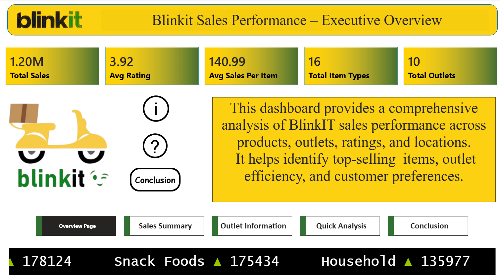
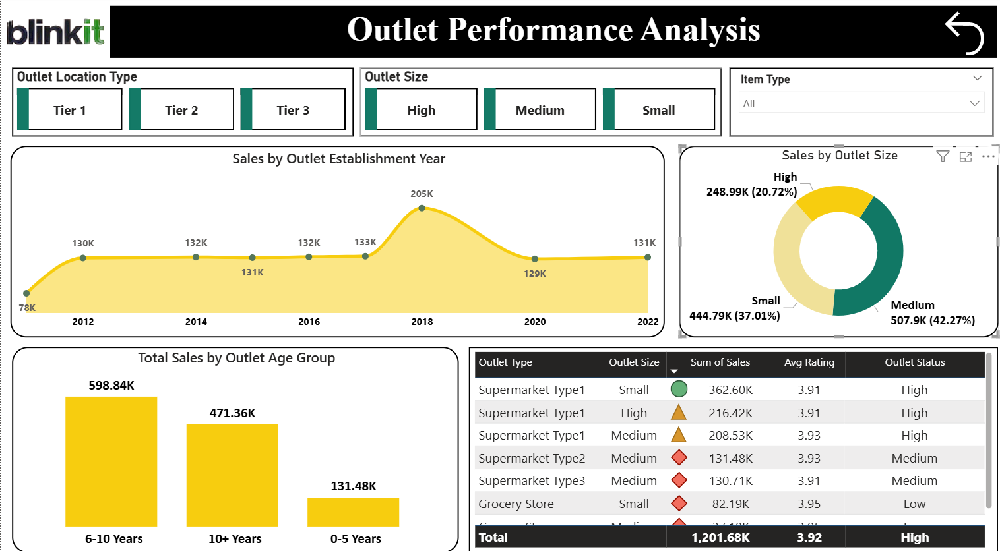
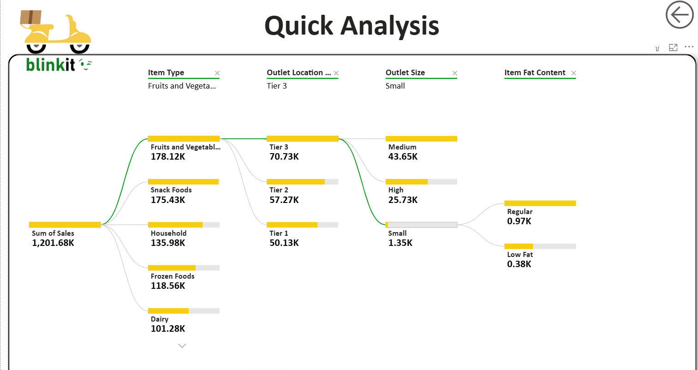
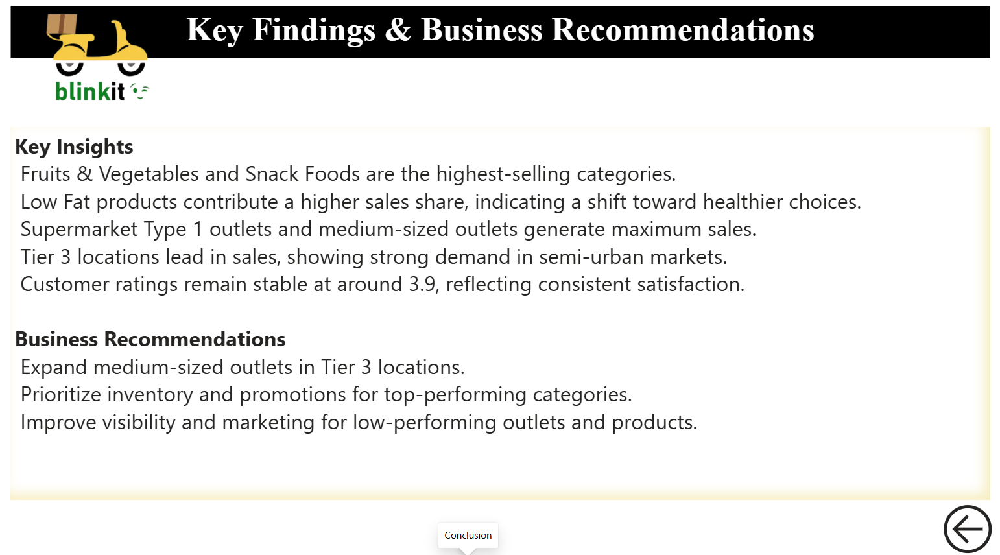

# Blinkit Sales Performance Dashboard 



> **Self-Made Project** | Resume Project  
> A comprehensive 5-page Power BI dashboard analyzing Blinkit's sales performance across products, outlets, locations, and customer preferences — with Excel used for data cleaning and preparation.
 
---

## Project Overview

This project analyzes BlinkIT grocery delivery sales data to uncover performance trends across product categories, outlet types, tier locations, and outlet sizes. The dashboard is designed as an **executive-level report** with 5 interactive pages covering everything from a high-level overview to a granular decomposition tree.

**Key business questions answered:**
- Which product categories and item types drive the most sales?
- How do outlet type, size, and location tier affect performance?
- What is the impact of fat content (Low Fat vs Regular) on sales?
- Which outlets are highest performing and which need improvement?
- What are the key business recommendations based on the data?

---

## Tools Used

| Tool | Purpose |
|------|---------|
| **Excel** | Data cleaning, formatting, handling missing values, data preparation before loading into Power BI |
| **Power BI** | 5-page interactive dashboard — Overview, Sales Summary, Outlet Performance, Quick Analysis, Conclusion |

---

## Dashboard Pages

| Page | Preview |
|------|---------|
| **Overview / Executive Summary** |  |
| **Product Performance & Sales Contribution** |  |
| **Outlet Performance Analysis** |  |
| **Quick Analysis (Decomposition Tree)** |  |
| **Key Findings & Business Recommendations** |  |

---

## Key Business Insights

### Overall KPIs
- **Total Sales: $1.20M** across 10 outlets and 16 item types
- **Average Rating: 3.92** — consistently high customer satisfaction
- **Average Sales Per Item: $140.99**
- **Total Outlets: 10** | **Total Item Types: 16**

### Product Performance
- **Fruits & Vegetables** is the top-selling category at **178K**, followed by **Snack Foods (175K)** and **Household (136K)**
- **Low Fat products** dominate at **64.6% (776.32K)** vs Regular at **35.4% (425.36K)** — strong consumer shift toward healthy options
- Bottom categories: Seafood (9K), Breakfast (16K), Starchy Foods (22K)

### Outlet Performance
- **Supermarket Type 1** is the top outlet type at **787.55K** — 3× higher than any other outlet type
- **Medium-sized outlets** generate the most revenue at **507.9K (42.27%)**, followed by Small (444.79K, 37.01%) and High (248.99K, 20.72%)
- **Tier 3 locations** lead with **472.13K**, followed by Tier 2 (393.15K) and Tier 1 (336.40K) — strong semi-urban market demand
- **Outlets established in 2018** had the highest sales at **205K**; recent outlets (2022) at **131K**
- **6–10 year old outlets (598.84K)** outperform 10+ year (471.36K) and 0–5 year (131.48K) outlets

### Quick Analysis — Decomposition Tree
- Total Sales of **1,201.68K** broken down by: Item Type → Outlet Location Tier → Outlet Size → Fat Content
- Fruits & Vegetables (178.12K) in Tier 3 (70.73K) → Medium size (43.65K) is the top path

### Key Findings & Business Recommendations
**Findings:**
- Fruits & Vegetables and Snack Foods are the highest-selling categories
- Low Fat products contribute a higher sales share — indicating shift toward healthier choices
- Supermarket Type 1 outlets and medium-sized outlets generate maximum sales
- Tier 3 locations lead in sales — showing strong demand in semi-urban markets
- Customer ratings remain stable at ~3.9 — consistent satisfaction

**Recommendations:**
- Expand medium-sized outlets in Tier 3 locations
- Prioritize inventory and promotions for top-performing categories
- Improve visibility and marketing for low-performing outlets and products

---

## Project Structure

```
05_Blinkit-Sales-Dashboard/
│
├── README.md                          ← You are here
│
├── raw-data/
│   └── README.md                      ← Dataset description
│
├── excel/
│   ├── Blinkit Grocery Data.xlsx      ← Excel cleaned dataset
│   └── README.md
│
├── powerbi/
│   ├── Blinkit_Dashboard.pbix         ← Power BI 5-page dashboard
│   └── README.md
│
└── Screenshots/
    ├── B1.png                         ← Overview / Executive Summary
    ├── B2.png                         ← Product Performance & Sales
    ├── B3.png                         ← Outlet Performance Analysis
    ├── B4.png                         ← Quick Analysis (Decomposition Tree)
    └── B5.png                         ← Key Findings & Recommendations
```

---

## Dataset

- **Source:** BlinkIT Grocery Sales Dataset
- **Cleaned using:** Microsoft Excel (removed nulls, standardized categories, formatted columns)
- **Total Records:** Sales data across 10 outlets, 16 item types
- **Key Fields:** Item Type, Item Fat Content, Outlet Type, Outlet Size, Outlet Location Type, Outlet Establishment Year, Sales, Rating

---

## Author

**Piyush Dave**  
Data Analyst | SQL · Power BI · Tableau · Excel · Python

[](https://www.linkedin.com/in/piyush-dave-0980a03a8)
[](https://public.tableau.com/app/profile/piyushdave/vizzes)
[](https://github.com/PiyushDave30)
