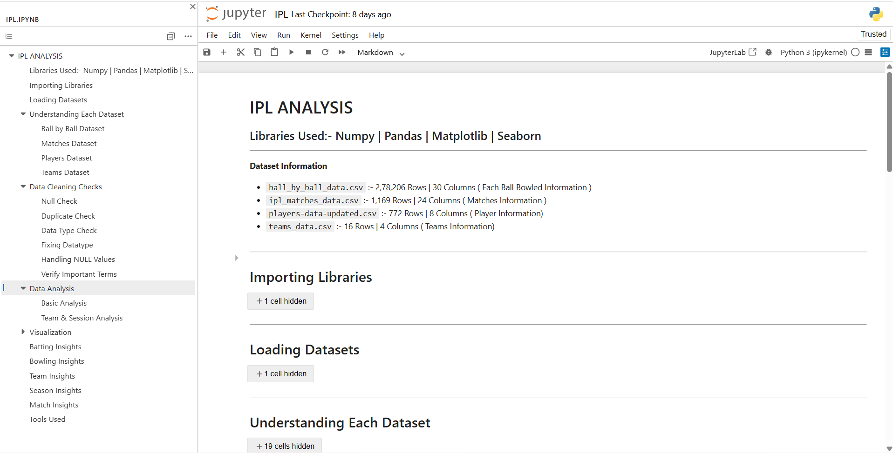

# Jupyter Notebook — IPL 18-Season Analysis

**File:** [IPL Analysis File](IPL-Analysis.ipynb)  
**Total Cells:** 156 | **Charts:** 44+ 

---

## Complete Notebook Walkthrough

### Step 1 — Import Libraries
```python
import numpy as np
import pandas as pd
import matplotlib.pyplot as plt
import seaborn as sns
```

---

### Step 2 — Load Datasets
```python
ball    = pd.read_csv('ball_by_ball_data.csv',      encoding='latin1')
matches = pd.read_csv('ipl_matches_data.csv',        encoding='latin1')
players = pd.read_csv('players-data-updated.csv',    encoding='latin1')
teams   = pd.read_csv('teams_data.csv',              encoding='latin1')
```

---

### Step 3 — EDA (Each Dataset)
```python
df.shape          # Rows × Columns
df.columns        # Column names
df.dtypes         # Data types
df.info()         # Full info
df.head()         # First 5 rows
df.tail()         # Last 5 rows
df.sample()       # Random row
df.describe()     # Statistics
df.isnull().sum() # Null counts
df.duplicated().sum() # Duplicate count
df.value_counts() # Category frequency
df.nunique()      # Unique value count
df.unique()       # Unique values
```

---

### Step 4 — Data Cleaning

| Column | Issue | Fix |
|--------|-------|-----|
| `match_date` | object dtype | `pd.to_datetime(dayfirst=True)` |
| `year`, `month`, `day_name` | missing | Extracted from `match_date` |
| `win_by_runs` | 638 nulls | `fillna(0).astype('int')` |
| `win_by_wickets` | 554 nulls | `fillna(0).astype('int')` |
| `stage` | 1,165 nulls | `fillna('League Match')` |
| `city` | 51 nulls | `fillna('NA')` |
| `bowl_style` | 13 nulls | `fillna('NA')` |
| `player_image` | 638 nulls | `fillna('NA')` |
| `field_pos` | 612 hidden spaces + 65 NaN | `str.strip()` → `replace('', pd.NA)` → `fillna('NA')` |
| Duplicates | Checked all 4 datasets | **0 duplicates confirmed** ✅ |

---

### Step 5 — Verify Important Terms
```python
# Printed: total seasons, total players, total teams,
#          total matches, total unique venues
```

---

### Step 6 — Data Analysis (20+ Analyses)

#### Batting Analysis
| Variable | Logic | Top Result |
|----------|-------|------------|
| `top_batters` | `groupby('batter')['batter_runs'].sum().sort_values(desc)` | V Kohli — 8,671 runs |
| `six_hitters` | filter `batter_runs==6` → groupby → size | CH Gayle — 359 sixes |
| `four_hitters` | filter `batter_runs==4` → groupby → size | V Kohli — 774 fours |
| `balls_faced` | `groupby('batter')['ball_number'].count()` | V Kohli — 6,702 balls |
| `batter_vs_bowler` | `groupby(['batter','bowler'])['batter_runs'].sum()` | DA Warner vs SP Narine — 195 runs |

#### Bowling Analysis
| Variable | Logic | Top Result |
|----------|-------|------------|
| `top_bowler` | filter `is_wicket==True` → groupby → count | YS Chahal — 229 wickets |
| `dot_ball_bowled` | filter `total_runs==0` → groupby → size | B Kumar — 1,748 dots |
| `Most_Wide_Ball_Bowled` | filter `is_wide_ball==True` → groupby → sum | DJ Bravo — 167 wides |
| `runs_conceed` | `groupby('bowler')['total_runs'].sum()` | R Ashwin — 5,721 runs |
| `most_extras` | `groupby('bowler')['extras'].sum()` | B Kumar — 320 extras |
| `over_bowled` | `groupby('bowler')['over_number'].count()` | R Ashwin — 4,868 balls |

#### Team Analysis
| Variable | Logic | Top Result |
|----------|-------|------------|
| `matches_played` | `groupby('team_batting')['match_id'].nunique()` | MI — 277 matches |
| `team_wins` | filter `result=='win'` → groupby `match_winner` → size | MI — 151 wins |
| `data` | merge matches_played + team_wins + Losses = Matches − Wins | MI dominates |
| `team_runs` | `groupby('team_batting')['total_runs'].sum()` | MI — 45,088 runs |
| `toss_count` | `groupby('toss_winner').size()` | MI — 151 toss wins |

#### Season Analysis
| Variable | Logic | Top Result |
|----------|-------|------------|
| `runs_per_season` | `groupby('season')['batter_runs'].sum()` | 2025 — 26,527 runs |
| `matches_per_season` | `groupby('season_id')['match_id'].nunique()` | 2025 — 74 matches |
| `season_sixes` | merge ball+matches → filter `batter_runs==6` → groupby season | Trending up |
| `season_fours` | merge ball+matches → filter `batter_runs==4` → groupby season | Trending up |
| `season_runs` | groupby season → agg total_runs, total_balls, avg_run_rate | 2025 highest |
| `over_analysis` | `groupby('over_number')['total_runs'].sum()` | Over 17–18 highest |
| `powerplay_vs_deathover_wickets` | filter overs 0–5 and 16–19 → filter `is_wicket==True` | Compared |

#### Match Analysis
| Variable | Logic | Top Result |
|----------|-------|------------|
| `man_of_match` | `groupby('player_of_match').size()` → merge players | AB de Villiers — 25 awards |
| `wicket_types` | filter `is_wicket==True` → `value_counts('wicket_kind')` | Caught — ~50% |

---

### Step 7 — Visualization (44+ Charts)

Every analysis visualized TWICE — `#MP` (Matplotlib) and `#SB` (Seaborn)

#### Batting (Charts 1–4, MP + SB)
| # | Chart | Type | Variable |
|---|-------|------|----------|
| 1 | Most Balls Faced | Bar | `balls_faced` |
| 2 | Top 10 Run Scorers | Bar | `top_batters` |
| 3 | Top 10 Six Hitters | Bar | `six_hitters` |
| 4 | Top 10 Four Hitters | Bar | `four_hitters` |

#### Bowling (Charts 5–10, MP + SB)
| # | Chart | Type | Variable |
|---|-------|------|----------|
| 5 | Top 10 Wicket Takers | Bar | `top_bowler` |
| 6 | Most Dot Balls | Bar | `dot_ball_bowled` |
| 7 | Most Wide Balls | Bar | `Most_Wide_Ball_Bowled` |
| 8 | Most Runs Conceded | Bar | `runs_conceed` |
| 9 | Most Extras Given | Bar | `most_extras` |
| 10 | Most Overs Bowled | Bar | `over_bowled` |

#### Team (Charts 11–15, MP + SB)
| # | Chart | Type | Variable |
|---|-------|------|----------|
| 11 | Total Matches Played | Bar | `matches_played` |
| 12 | Most Wins by Team | Bar | `team_wins` |
| 13 | Wins vs Losses | Grouped Bar | `data` (melt for SB) |
| 14 | Total Runs by Team | Bar | `team_runs` |
| 15 | Most Toss Wins | Bar | `toss_count` |

#### Season (Charts 16–20, MP + SB)
| # | Chart | Type | Variable |
|---|-------|------|----------|
| 16 | Total Runs per Season | Line | `runs_per_season` |
| 17 | Matches per Season | Line | `matches_per_season` |
| 18 | Sixes & Fours Trend | Line | `season_sixes`, `season_fours` |
| 19 | Avg Run Rate per Season | Line | `season_runs` |
| 20 | Runs per Over (0–19) | Bar | `over_analysis` (seagreen=powerplay, steelblue=middle, crimson=death) |

#### Match (Charts 21–25)
| # | Chart | Type | Variable |
|---|-------|------|----------|
| 21 | Toss Decision | Pie | `matches['toss_decision'].value_counts()` |
| 22 | Wicket Types | Bar | `wicket_types` (MP + SB) |
| 23 | Match Result Types | Pie | `matches['result'].value_counts()` |
| 24 | Man of the Match | Bar | `man_of_match` (MP + SB) |
| 25 | Innings Score Distribution | Histogram | groupby match_id + innings (MP + SB with kde=True) |

---

### Step 8 — Insight Markdowns
A `>` markdown insight after every single chart explaining the key finding.

---

### Step 9 — Conclusion
Full summary covering all 5 analysis dimensions with tools used table.

---

## Jupyter Notebook

Access the complete end-to-end IPL analysis notebook below:

[](notebooks/IPL-Analysis.ipynb)

### Notebook Highlights
- 156 notebook cells
- 44+ visualizations
- Complete EDA workflow
- Data cleaning & preprocessing
- Batting, bowling, team & season analysis
- Insights after every chart
- Built using Pandas, NumPy, Matplotlib & Seaborn
---



---

## Coding Style
- Comments on every line
- `#MP` prefix for all Matplotlib cells, `#SB` for Seaborn cells
- `plt.bar_label()` for value labels on every bar chart
- `plt.gca().invert_yaxis()` for horizontal bars
- `plt.tight_layout()` + `plt.show()` on every chart
- `sort_values(ascending=False).head(10)` for all top-N charts
- `reset_index()` after every groupby
- Column rename after groupby: `df.columns = ['col1', 'col2']`
