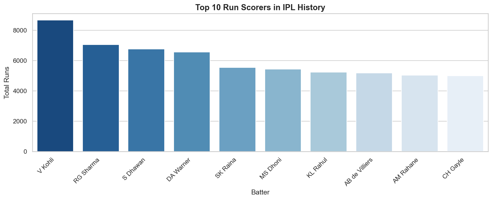
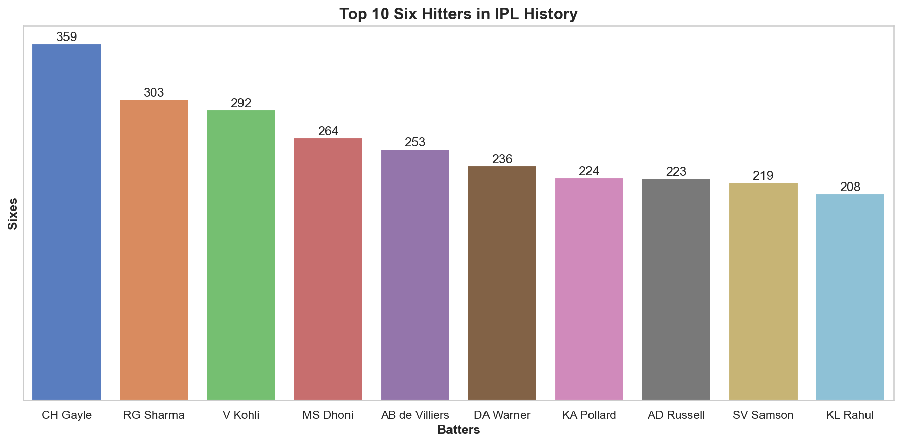
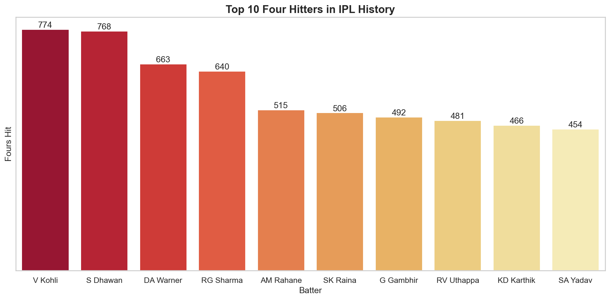
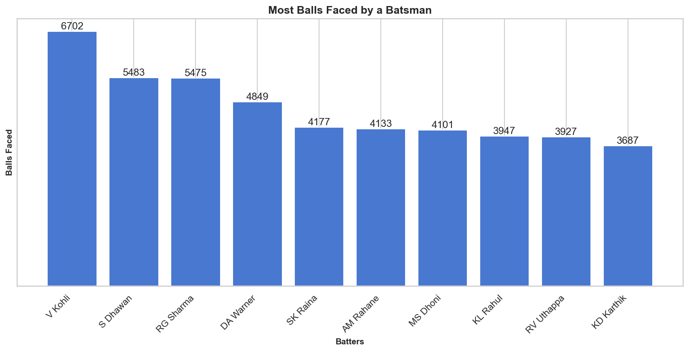
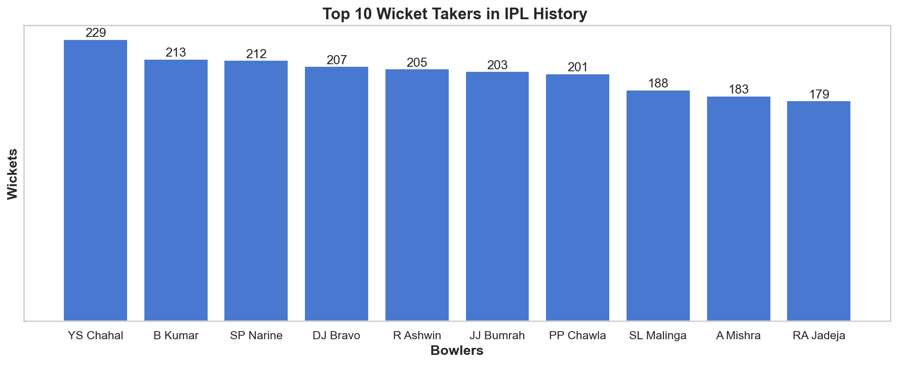
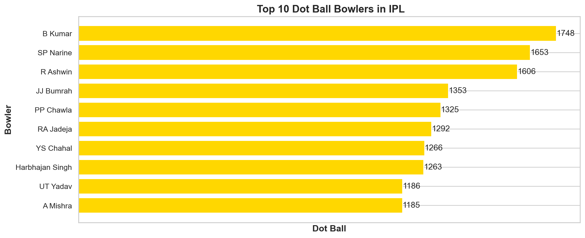
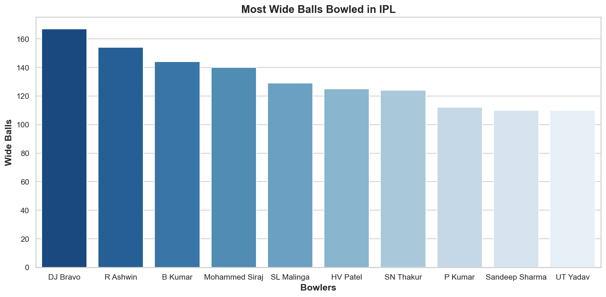
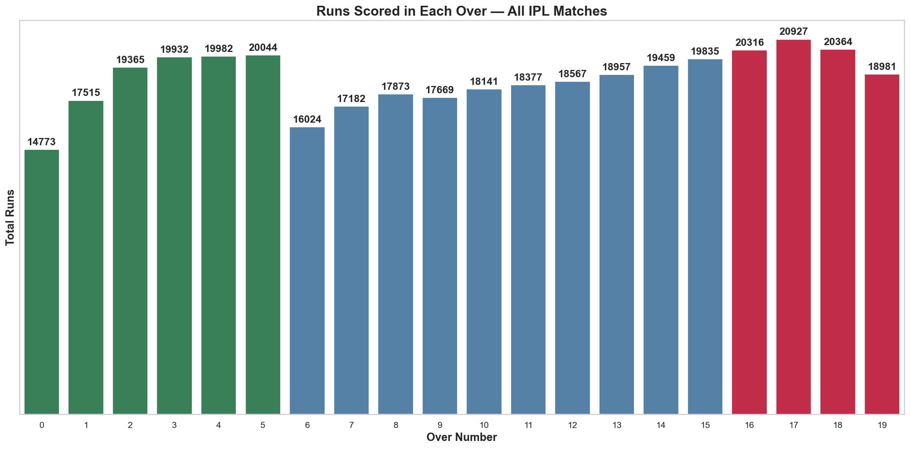

# IPL 18-Season Analysis 🏏


---

> **Self-Made Project**  
> A complete end-to-end data analytics project on Indian Premier League (IPL) cricket data covering 18 seasons (2008–2025), 1,169 matches, and 2,78,205 ball-by-ball deliveries — using Python with Pandas, NumPy, Matplotlib, and Seaborn in Jupyter Notebook.

---

## 📌 Project Overview

This project performs a full data analytics workflow on IPL data — from raw CSV loading to deep statistical analysis and 44+ visualizations across batting, bowling, team, season, and match dimensions.

**Key questions answered:**
- Who are the all-time greatest batters and bowlers in IPL history?
- Which teams dominate across wins, runs, and toss decisions?
- How has IPL evolved across 18 seasons in scoring and match patterns?
- What does over-by-over analysis reveal about powerplay vs death overs?
- Which wicket types, match results, and toss decisions are most common?

---

## 🛠️ Tools Used

| Tool | Purpose |
|------|---------|
| **Python** | Complete analysis — EDA, cleaning, analysis, visualization |
| **Pandas** | Data loading, cleaning, groupby analysis, merging datasets |
| **NumPy** | Numerical operations |
| **Matplotlib** | 22 charts — bar, line, pie, histogram |
| **Seaborn** | 22 charts — same analyses with advanced styling |
| **Jupyter Notebook** | Development environment |

---

## 📊 Datasets

| File | Rows | Columns | Description | GitHub |
|------|------|---------|-------------|--------|
| `ball_by_ball_data.csv` | 2,78,205 | 30 | Every ball bowled in IPL history | ❌ 25MB+ — too large |
| `ipl_matches_data.csv` | 1,169 | 24 | Match-level data — teams, result, venue, toss | ✅ Uploaded |
| `players-data-updated.csv` | 772 | 8 | Player profiles — bat/bowl style, field position | ✅ Uploaded |
| `teams_data.csv` | 16 | 4 | IPL team information | ✅ Uploaded |

> ⚠️ `ball_by_ball_data.csv` exceeds GitHub's 25MB limit. Download it separately from Kaggle and place it in the `data/` folder before running the notebook.

---

## 📓 Project Workflow

```
Load 4 CSVs → EDA → Data Cleaning → 20+ Analyses → 44+ Charts → Insights → Conclusion
```

| Step | Description |
|------|-------------|
| **1. Import Libraries** | pandas, numpy, matplotlib, seaborn |
| **2. Load Datasets** | 4 CSVs with latin1 encoding |
| **3. EDA** | shape, columns, dtypes, info, head, tail, describe, isnull, duplicated |
| **4. Data Cleaning** | Date conversion, fillna, type fixes, hidden space removal |
| **5. Analysis** | 20+ groupby analyses across batting, bowling, team, season, match |
| **6. Visualization** | 44+ charts — every analysis done in both Matplotlib and Seaborn |
| **7. Insights** | Markdown insight after every single chart |
| **8. Conclusion** | Full summary covering all 5 dimensions |

---

## 📊 Visualizations

### Batting Charts





### Bowling Charts




### Team Charts


### Season Charts



---

## 🔑 Key Insights

### 🏏 Batting
- **V Kohli** is the all-time IPL run scorer with **8,671 runs**, **774 fours**, and **6,702 balls faced** across 17+ seasons — consistency over explosiveness
- **CH Gayle** leads six-hitting with **359 sixes** — 56 more than RG Sharma (303)
- **DA Warner vs SP Narine** is the most productive batter-bowler matchup: Warner scored **195 runs** against Narine

### 🎯 Bowling
- **YS Chahal** leads all wicket takers with **229 wickets** — spinners dominate IPL conditions
- **B Kumar** bowls the most dot balls (**1,748**) AND gives the most extras (**320**) — highest workload
- **DJ Bravo** bowled the most wide balls (**167**) — death bowling pressure
- **R Ashwin** conceded the most runs (**5,721**) and bowled the most balls (**4,868**) — longest career

### 🏆 Teams
- **Mumbai Indians** dominates ALL metrics:
  - Most wins: **151**
  - Most matches: **277**
  - Most runs: **45,088**
  - Most toss wins: **151**
- MI vs CSK is the biggest rivalry — both dominate all-time charts
- Wins vs Losses chart shows MI with the highest win margin over losses

### 📅 Seasons
- **2025** is the highest-scoring season: **26,527 runs** across **74 matches**
- Average run rate per season shows a consistent **upward trend** — IPL scoring is getting more aggressive every year
- **Over 17–18** has the highest runs — not over 19 — showing death bowling is IPL's hardest skill
- **2020 dip** — COVID season played in UAE on slower pitches

### 🎲 Matches
- **58.4%** of toss winners choose to field first — chasing is the preferred strategy
- **99.3%** of matches produced a result — only 8 no-result matches in 18 seasons
- **Caught** is the most common dismissal type — ~50% of all wickets
- **AB de Villiers** won the most Player of the Match awards: **25**
- Most team innings score between **140–180 runs**

---

## 📁 Project Structure

```
06_IPL-18-Season-Analysis/
│
├── README.md                          ← You are here
│
├── data/
│   ├── ipl_matches_data.csv           ← 1,169 matches, 24 columns ✅
│   ├── players-data-updated.csv       ← 772 players, 8 columns ✅
│   ├── teams_data.csv                 ← 16 teams, 4 columns ✅
│   └── README.md
│
├── notebooks/
│   ├── IPL-Analysis.ipynb             ← Complete notebook — 156 cells, 44+ charts
│   └── README.md
│
└── Screenshots/
    ├── ipl_notebook_structure.png     ← Table of Contents — all sections
    ├── top_run_scorers.png            ← Batting — Seaborn
    ├── top_six_hitters.png            ← Batting — Seaborn
    ├── top_four_hitters.png           ← Batting — Seaborn
    ├── most_balls_faced.png           ← Batting — Seaborn
    ├── top_wicket_takers.png          ← Bowling — Seaborn
    ├── most_dot_balls.png             ← Bowling — Seaborn
    ├── most_wide_balls.png            ← Bowling — Seaborn
    ├── wins_vs_losses.png             ← Team — Matplotlib
    ├── avg_run_rate_per_season.png    ← Season — Matplotlib/Seaborn
    └── runs_per_over.png              ← Season — Matplotlib (colour coded)
```

---

## 📈 Project Stats

| Metric | Value |
|--------|-------|
| Total Seasons | 18 (2008–2025) |
| Total Matches | 1,169 |
| Total Deliveries | 2,78,205 |
| Total Players | 772 |
| Notebook Cells | 156 |
| Matplotlib Charts | 22 |
| Seaborn Charts | 22 |
| Total Charts | 44+ |
| Errors / Warnings | 0 |

---

## 👤 Author

**Piyush Dave**  
Data Analyst | SQL · Power BI · Tableau · Excel · Python

[](https://www.linkedin.com/in/piyush-dave-0980a03a8)
[](https://public.tableau.com/app/profile/piyushdave/vizzes)
[](https://github.com/PiyushDave30)
