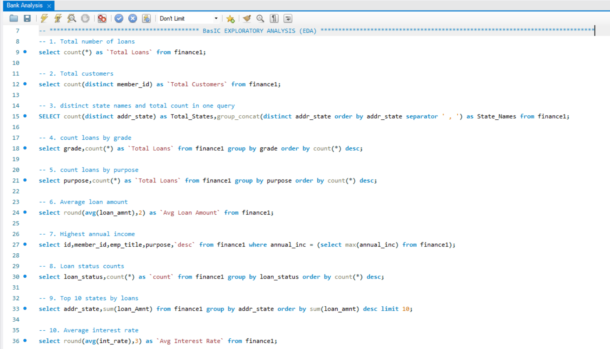
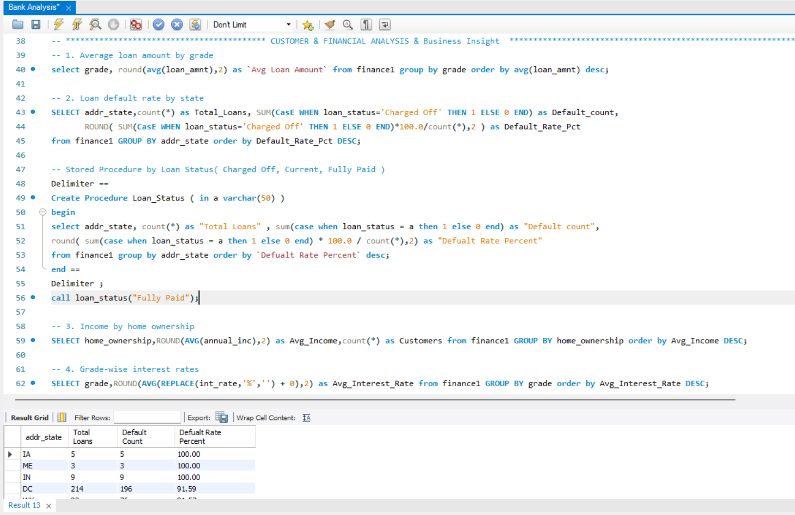
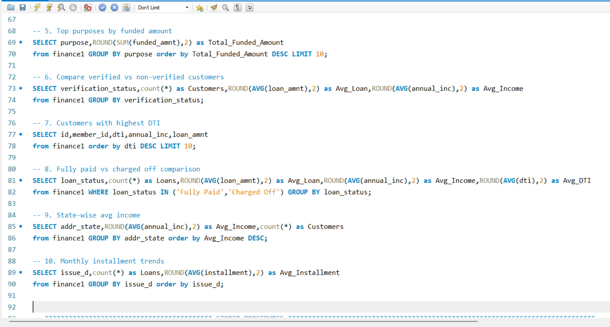
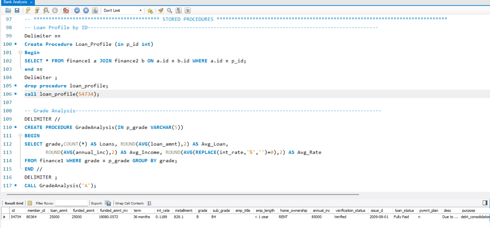
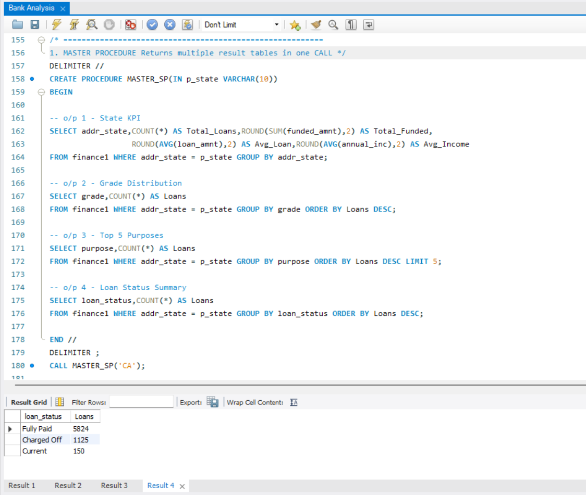
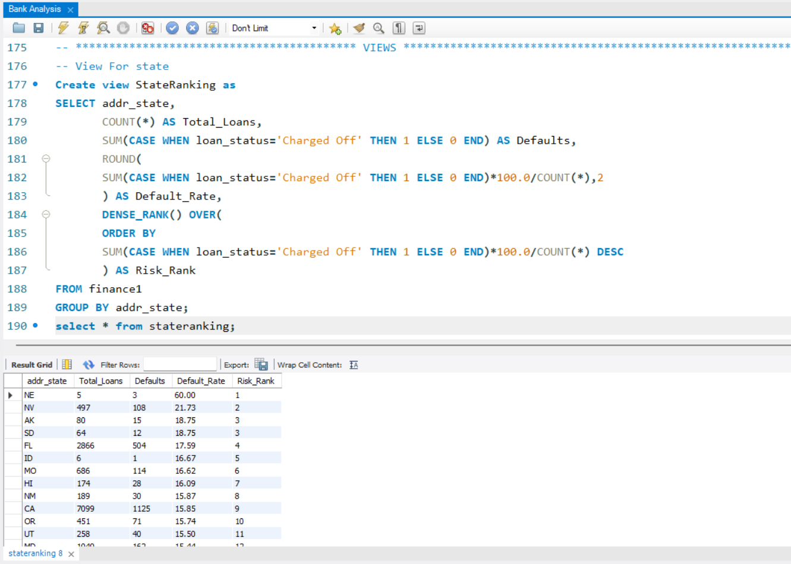

# Bank Loan Analysis



> **Self-Made Project**  
> A comprehensive bank loan analysis using advanced SQL — covering 20+ queries across EDA, customer profiling, financial risk assessment, stored procedures, views, and window functions on a real-world lending dataset.
 
---

## Project Overview

This project performs an end-to-end SQL analysis on a bank lending dataset (`finance1` + `finance2`) to understand loan performance, customer risk profiles, default patterns, and business insights across US states, loan grades, and purposes.

**Key business questions answered:**
- What is the overall loan portfolio composition and default rate?
- Which states and loan grades carry the highest financial risk?
- How do verified vs non-verified customers compare in loan behavior?
- What are the top loan purposes and their funded amounts?
- Which customers have the highest Debt-to-Income (DTI) ratio?

---

## Tools Used

| Tool | Purpose |
|------|---------|
| **MySQL Workbench** | All analysis — EDA, financial analysis, stored procedures, views, window functions |

---

## SQL Query Screenshots

| Query Set | Preview |
|-----------|---------|
| **Basic EDA — 10 queries** |  |
| **Customer & Financial Analysis** |  |
| **Business Insight queries** |  |
| **Stored Procedures — Loan Profile + Grade Analysis** |  |
| **Master Stored Procedure — 4 result tables in 1 CALL**|  |
| **StateRanking VIEW with DENSE_RANK** |  |

---

## Key Business Insights

### Basic EDA Findings
- Total loans, unique customers, and distinct states extracted in single queries
- `GROUP_CONCAT(DISTINCT addr_state)` used to get all state names + count in one query
- Loans broken down by **grade** (A–G) and **purpose** (debt consolidation, credit card, home improvement etc.)
- Top 10 states by total loan amount identified
- Avg loan amount and avg interest rate calculated across the portfolio

### Customer & Financial Analysis
- **Loan default rate** calculated per state using `SUM(CASE WHEN loan_status='Charged Off')` / COUNT(*)
- **Grade-wise avg loan amount** — higher grades (A, B) tend to have lower avg loan amounts
- **Income by home ownership** — RENT vs MORTGAGE vs OWN comparison
- **Grade-wise interest rates** — using `REPLACE(int_rate,'%','')` to convert string % to numeric for AVG calculation

### Business Insights
- **Top purposes by funded amount** — debt consolidation dominates
- **Verified vs Non-Verified customers** — comparison of avg loan, avg income, count
- **Highest DTI customers** — top 10 riskiest customers identified
- **Fully Paid vs Charged Off** — side-by-side comparison of avg loan, avg income, avg DTI
- **State-wise avg income** — geographic income distribution
- **Monthly installment trends** by issue date

### StateRanking VIEW Output
- NE — Default Rate: **60.00%** (Risk Rank 1)
- NV — Default Rate: **21.73%** (Risk Rank 2)
- AK/SD — Default Rate: **18.75%** (Risk Rank 3)
- CA — Default Rate: **15.85%** (Risk Rank 9) with 7,099 total loans

### Stored Procedures
- **`Loan_Profile(p_id INT)`** — full loan profile for any customer by ID (JOIN finance1 + finance2)
- **`GradeAnalysis(p_grade VARCHAR)`** — returns loans count, avg loan, avg income, avg interest rate for any grade
- **`Loan_Status(a VARCHAR)`** — state-wise breakdown for any loan status (Fully Paid / Charged Off / Current)
- **`MASTER_SP(p_state VARCHAR)`** — returns **4 result tables in a single CALL**: State KPI, Grade Distribution, Top 5 Purposes, Loan Status Summary

---

## Project Structure

```
07_Bank-Analysis/
│
├── README.md                      ← You are here
│
├── raw-data/
│   └── README.md
│
├── sql/
│   ├── Bank_Analysis.sql          ← All 20+ queries
│   └── README.md
│
└── Screenshots/
    ├── BA1.png                    ← Stored Procedures: Loan_Profile + GradeAnalysis
    ├── BA2.png                    ← Master SP: 4 result tables in one CALL
    ├── BA3.png                    ← StateRanking VIEW with DENSE_RANK output
    ├── BA4.png                    ← Basic EDA — 10 queries
    ├── BA5.png                    ← Customer & Financial Analysis
    └── BA6.png                    ← Business Insight queries
```

---

## Dataset

- **Source:** Bank Loan / Lending Club Dataset
- **Tables:** `finance1` (loan info), `finance2` (financial details)
- **Join Key:** `finance1.id = finance2.id`
- **Key Fields:** id, member_id, loan_amnt, funded_amnt, int_rate, installment, grade, sub_grade, emp_title, emp_length, home_ownership, annual_inc, verification_status, issue_d, loan_status, purpose, addr_state, dti

---

## Author

**Piyush Dave**  
Data Analyst | SQL · Power BI · Tableau · Excel · Python

[](https://www.linkedin.com/in/piyush-dave-0980a03a8)
[](https://public.tableau.com/app/profile/piyushdave/vizzes)
[](https://github.com/PiyushDave30)
