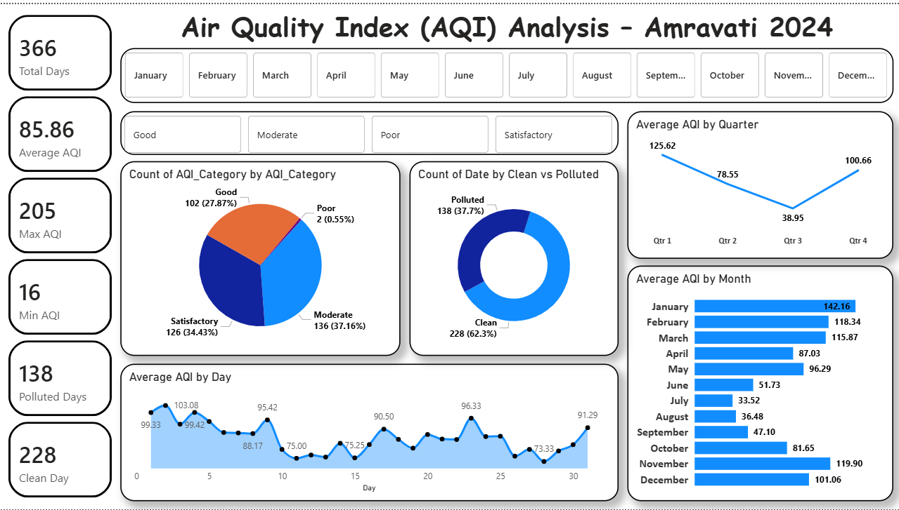

# Amravati AQI 2024 Analysis 🌫️



> **Self-Made Project** | Original Data Collection  
> An end-to-end air quality analysis of Amravati city for the year 2024 — raw AQI data collected directly from the official CPCB government website, cleaned using Python in Jupyter Notebook, exported to Excel, and visualized in a Power BI dashboard.

---

## 📌 Project Overview

This project is unique because the data was **personally collected from India's official air quality monitoring authority (CPCB)** — not from Kaggle or any third-party source. Daily AQI readings for Amravati city throughout 2024 were downloaded, cleaned using Python, and then built into a comprehensive Power BI dashboard.

**Key questions answered:**
- What is the overall air quality of Amravati in 2024?
- Which months and quarters have the worst air pollution?
- How many days were clean vs polluted throughout the year?
- What is the day-wise AQI trend across the month?
- Which AQI category dominates — Good, Satisfactory, Moderate, or Poor?

---

## 🛠️ Tools & Workflow

```
CPCB Website → Raw AQI CSV → Python (Jupyter Notebook) → Cleaned Excel → Power BI Dashboard
```

| Step | Tool | Task |
|------|------|------|
| **1. Data Collection** | CPCB Official Website | Downloaded daily AQI data for Amravati 2024 |
| **2. Data Cleaning** | Python — Pandas (Jupyter Notebook) | Handled nulls, formatted dates, created AQI categories, added Clean/Polluted flag |
| **3. Export** | Python → Excel | Cleaned DataFrame exported to `.xlsx` for Power BI import |
| **4. Dashboard** | Power BI | Interactive AQI dashboard with month/category filters |

---

## 📊 Dashboard

### Power BI — Air Quality Index (AQI) Analysis – Amravati 2024


---

## 🔑 Key Insights

### Overall AQI Summary
| Metric | Value |
|--------|-------|
| Total Days Analyzed | 366 (full year 2024) |
| Average AQI | 85.86 |
| Maximum AQI | 205 (Poor category) |
| Minimum AQI | 16 (Good category) |
| Clean Days | 228 (62.3%) |
| Polluted Days | 138 (37.7%) |

### AQI Category Breakdown
| Category | Days | Percentage |
|----------|------|------------|
| Moderate | 136 | 37.16% |
| Satisfactory | 126 | 34.43% |
| Good | 102 | 27.87% |
| Poor | 2 | 0.55% |

### Quarterly Trend
| Quarter | Avg AQI | Observation |
|---------|---------|-------------|
| Q1 (Jan–Mar) | 125.62 | Worst — winter pollution, crop burning |
| Q2 (Apr–Jun) | 78.55 | Improving — pre-monsoon |
| Q3 (Jul–Sep) | 38.95 | Best — monsoon cleans the air |
| Q4 (Oct–Dec) | 100.66 | Rising again — post-monsoon, winter onset |

### Monthly AQI (Best to Worst)
| Month | Avg AQI | Air Quality |
|-------|---------|-------------|
| July | 33.52 | 🟢 Best |
| August | 36.48 | 🟢 Good |
| September | 47.10 | 🟢 Good |
| June | 51.73 | 🟡 Satisfactory |
| October | 81.65 | 🟡 Satisfactory |
| May | 96.29 | 🟡 Satisfactory |
| April | 87.03 | 🟡 Satisfactory |
| December | 101.06 | 🟠 Moderate |
| March | 115.87 | 🟠 Moderate |
| February | 118.34 | 🟠 Moderate |
| November | 119.90 | 🟠 Moderate |
| January | 142.16 | 🔴 Worst |

### Key Findings
- **Winter months (Jan, Feb, Nov, Dec)** consistently show the worst AQI — likely due to cold weather trapping pollutants and crop stubble burning
- **Monsoon months (Jul, Aug, Sep)** are the cleanest — rain washes out particulate matter
- **62.3% of the year** Amravati had clean air — but the 37.7% polluted days still pose a health concern
- Only **2 days** recorded "Poor" AQI — extreme pollution events were rare in 2024
- Day-wise AQI fluctuates between **73–103** showing daily variability within months

---

## 📁 Project Structure

```
10_Amravati-AQI-2024-Analysis/
│
├── README.md                              ← You are here
│
├── data/
│   ├── amravati_aqi_raw.csv               ← Original data from CPCB website
│   ├── amravati_aqi_cleaned.xlsx          ← Cleaned data exported from Python
│   └── README.md
│
├── notebooks/
│   ├── AQI_Cleaning_Analysis.ipynb        ← Jupyter Notebook — cleaning + EDA
│   └── README.md
│
├── powerbi/
│   ├── Amravati_AQI_2024.pbix             ← Power BI dashboard file
│   └── README.md
│
└── Screenshots/
    ├── AQI.png                            ← Full Power BI dashboard
    └── README.md
```

---

## 📂 Data Source

| Detail | Info |
|--------|------|
| **Official Source** | Central Pollution Control Board (CPCB), Government of India |
| **Repository** | [CPCB AQI Repository](https://airquality.cpcb.gov.in/ccr/#/caaqm-dashboard-all/caaqm-landing/aqi-repository) |
| **City** | Amravati, Maharashtra |
| **Year** | 2024 (366 days — leap year) |
| **Data Type** | Daily AQI readings |

---

## 🌐 References

| Resource | Link |
|----------|------|
| CPCB Official AQI Data | [airquality.cpcb.gov.in](https://airquality.cpcb.gov.in/ccr/#/caaqm-dashboard-all/caaqm-landing/aqi-repository) |
| Jupyter Notebook | Run locally — `AQI_Cleaning_Analysis.ipynb` |

---

## 👤 Author

**Piyush Dave**  
Data Analyst | SQL · Power BI · Tableau · Excel · Python

[](https://www.linkedin.com/in/piyush-dave-0980a03a8)
[](https://public.tableau.com/app/profile/piyushdave/vizzes)
[](https://github.com/PiyushDave30)

---

> *Data collected directly from India's official CPCB air quality monitoring platform — not from any third-party dataset source.*
