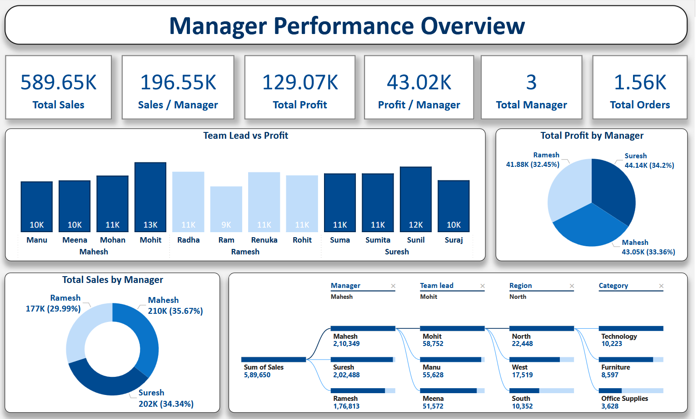
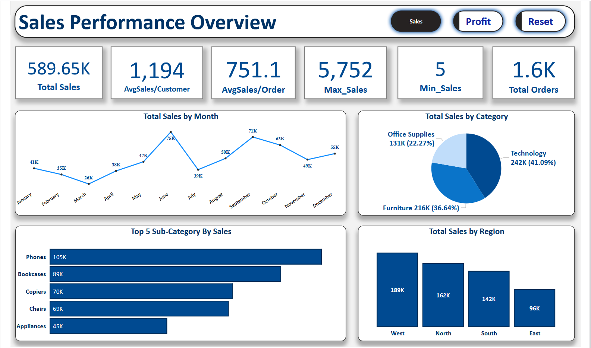
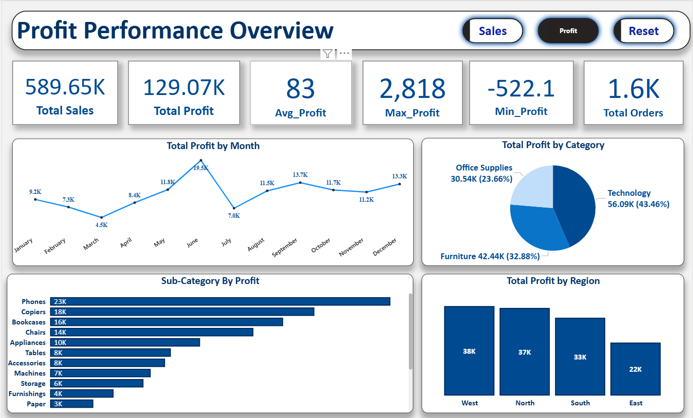
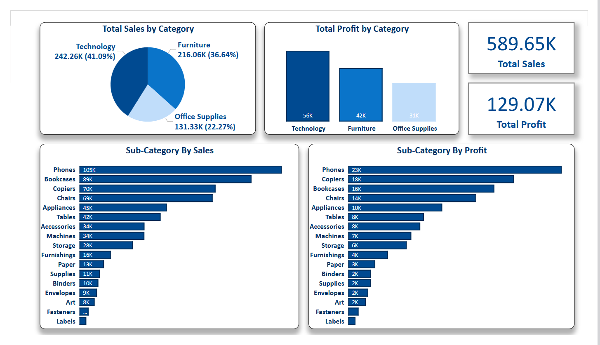
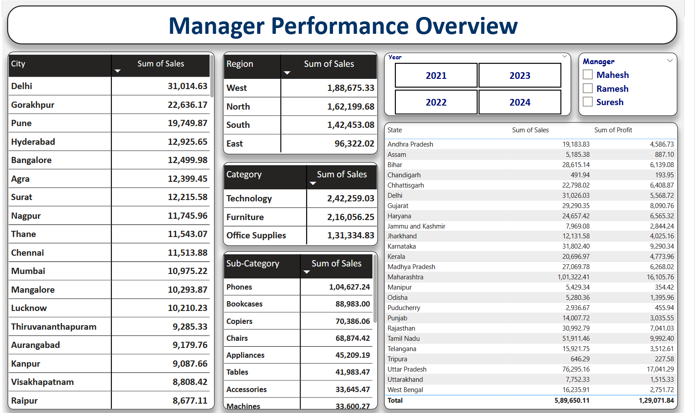

# India Sales Dashboard



> **Self-Made Project**  
> A comprehensive 5-page Power BI dashboard analyzing India sales performance across managers, regions, categories, sub-categories, cities, and states — covering Sales, Profit, and Manager performance with interactive filters.
  
---

## Project Overview

This project analyzes a fictional Indian sales dataset covering managers, team leads, regions, categories, and sub-categories. The dashboard is built across 5 dedicated pages offering different analytical perspectives — from high-level KPIs to granular state-wise and sub-category-level breakdowns.

**Key questions answered:**
- Which managers and team leads drive the most sales and profit?
- Which product categories and sub-categories perform best?
- How do sales and profit trend month by month?
- Which regions and states generate maximum revenue?
- How do sub-categories compare on both sales and profit dimensions?

---

## Tools Used

| Tool | Purpose |
|------|---------|
| **Power BI** | 5-page interactive dashboard with toggle buttons, decomposition tree, slicers |

---

## Dashboard Pages

| Page | Preview |
|------|---------|
| Manager Performance Overview |  |
| Sales Performance Overview |  |
| Profit Performance Overview |  |
| Category Analysis |  |
| Data Table |  |

---

## Key Business Insights

### Overall KPIs
| Metric | Value |
|--------|-------|
| Total Sales | 589.65K |
| Total Profit | 129.07K |
| Total Orders | 1,600 |
| Total Managers | 3 |
| Avg Sales per Customer | 1,194 |
| Avg Sales per Order | 751.1 |
| Max Sales (single order) | 5,752 |
| Avg Profit | 83 |
| Max Profit | 2,818 |
| Min Profit | -522.1 |

### Manager Performance
| Manager | Total Sales | Sales % | Total Profit | Profit % |
|---------|------------|---------|--------------|---------|
| Mahesh | 210K | 35.67% | 43.05K | 33.36% |
| Suresh | 202K | 34.34% | 44.14K | 34.20% |
| Ramesh | 177K | 29.99% | 41.88K | 32.45% |

- **Mahesh** leads in total sales (210K) but **Suresh** leads in profit (44.14K)
- **Sales per Manager: 196.55K** | **Profit per Manager: 43.02K**
- Decomposition tree: Sales (589,650) → Mahesh (210,349) → Mohit team lead → North region (22,448) → Technology (10,223)

### Category Performance
| Category | Sales | Sales % | Profit |
|----------|-------|---------|--------|
| Technology | 242K | 41.09% | 56K |
| Furniture | 216K | 36.64% | 42K |
| Office Supplies | 131K | 22.27% | 31K |

- **Technology** leads in both sales (41.09%) and profit (56K)
- **Phones** is the top sub-category by sales (105K) and profit (23K)
- **Copiers** rank 2nd in profit (18K), **Bookcases** 3rd (16K)

### Regional Performance
| Region | Sales | Profit |
|--------|-------|--------|
| West | 189K | 38K |
| North | 162K | 37K |
| South | 142K | 33K |
| East | 96K | 22K |

- **West** leads in both sales and profit
- **East** is the weakest performing region

### Monthly Trends
- **Sales peak: June (75K)** — highest sales month
- **Sales low: March (26K)** — lowest sales month
- **Profit peak: June (19.5K)**
- **Profit low: March (4.5K)** — consistent with sales trend
- July shows a sharp dip in both sales (39K) and profit (7K) before recovery

### City & State Performance
- **Delhi** is top city by sales: **31,014.63**
- **Maharashtra** is top state: **1,01,322.41** in sales, **16,105.76** in profit
- **Uttar Pradesh** 2nd: **76,295.16** sales, **17,041.29** profit
- Data available for years **2021, 2022, 2023, 2024** with Manager filter (Mahesh/Ramesh/Suresh)

### Top 5 Sub-Categories by Sales
| Rank | Sub-Category | Sales |
|------|-------------|-------|
| 1 | Phones | 105K |
| 2 | Bookcases | 89K |
| 3 | Copiers | 70K |
| 4 | Chairs | 69K |
| 5 | Appliances | 45K |

---

## Project Structure

```
10_India-Sales-Dashboard/
│
├── README.md                        ← You are here
│
├── raw-data/
│   └── README.md
│
├── powerbi/
│   ├── India_Sales_Dashboard.pbix   ← Power BI 5-page dashboard
│   └── README.md
│
└── Screenshots/
    ├── I1.png                       ← Manager Performance Overview
    ├── I2.png                       ← Profit Performance Overview
    ├── I3.png                       ← Data Table page
    ├── I4.png                       ← Sales Performance Overview
    └── I5.png                       ← Category Analysis
```

---

## Dataset

- **Source:** India Sales Dataset (Sales/Profit/Manager/Region data)
- **Coverage:** India — multiple cities and states
- **Years:** 2021, 2022, 2023, 2024
- **Key Fields:** Manager, Team Lead, Region, State, City, Category, Sub-Category, Sales, Profit, Orders

---

## Author

**Piyush Dave**  
Data Analyst | SQL · Power BI · Tableau · Excel · Python

[](https://www.linkedin.com/in/piyush-dave-0980a03a8)
[](https://public.tableau.com/app/profile/piyushdave/vizzes)
[](https://github.com/PiyushDave30)
