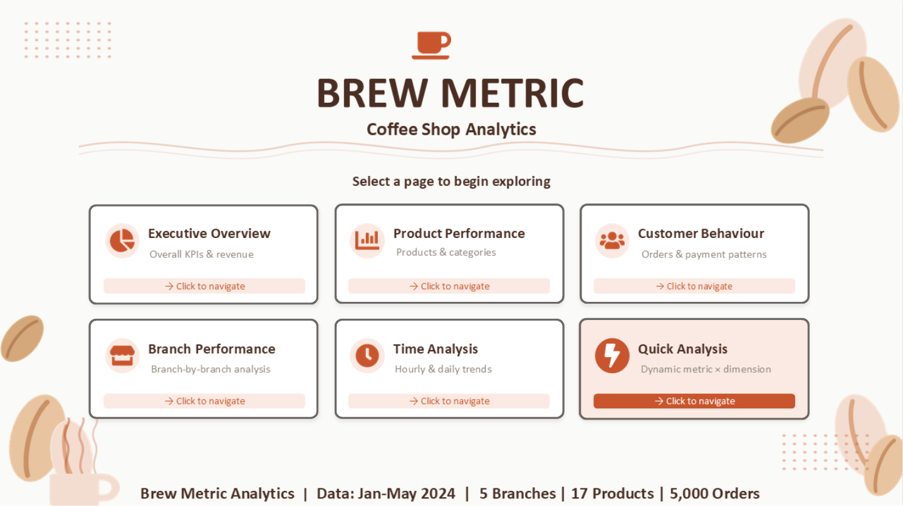
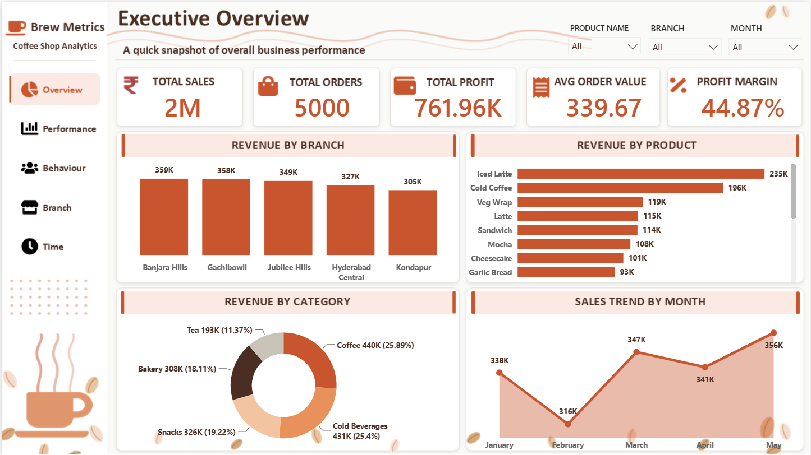
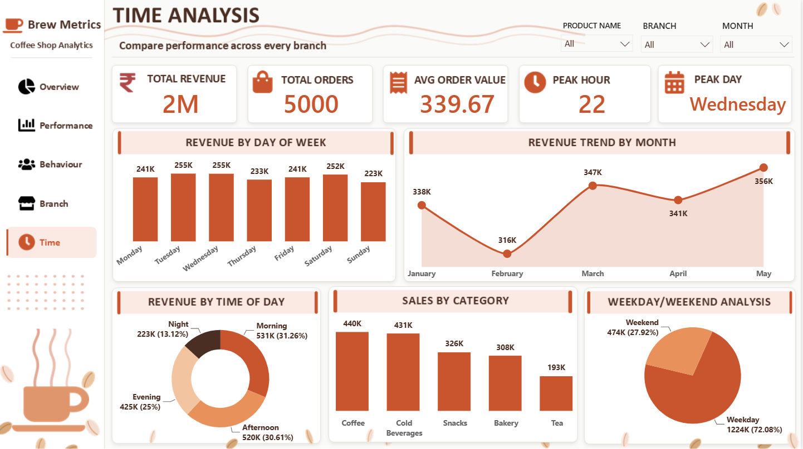
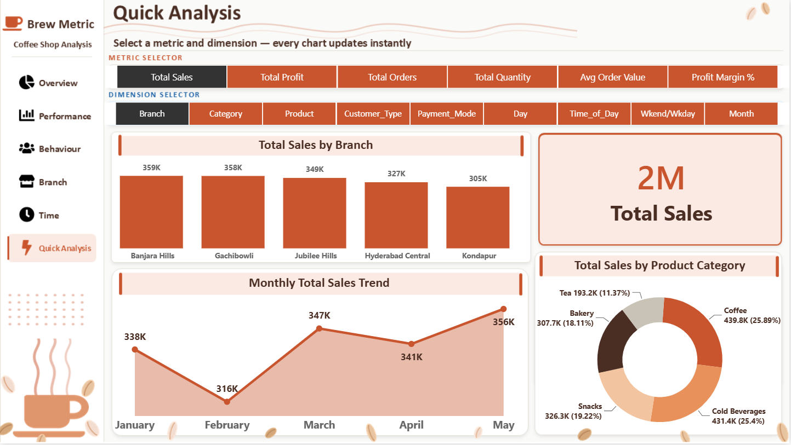

# 📊 Power BI Dashboard — Brew Metric Coffee Shop Analytics

This folder contains the Power BI dashboard for the Brew Metric Coffee Shop project.

--- 

## 📄 Files in This Folder

| File Name | Description |
|-----------|-------------|
| [Power BI Dashboard](COFFEE%20SHOP%20ANALYSIS.pbix) | Complete 7-page Power BI dashboard |
| [Home Page](C1.png) | Screenshot — Landing / Navigation page |
| [Executive Overview](C2.png) | Screenshot — Executive Overview |
| [Product Performance](C3.png) | Screenshot — Product Performance |
| [Customer Behaviour](C4.png) | Screenshot — Customer Behaviour |
| [Branch Performance](C5.png) | Screenshot — Branch Performance |
| [Time Analysis](C6.png) | Screenshot — Time Analysis |
| [Quick Analysis Page](C7.png) | Screenshot — Quick Analysis |

---

## 📋 Dashboard Pages

### Page 1 — Landing / Navigation

- **Brew Metric** branding with coffee cup logo
- 6 navigation cards — each links to a specific page
- Data summary footer: Jan-May 2024 | 5 Branches | 17 Products | 5,000 Orders
- Custom PowerPoint background — warm beige with coffee bean decorations

### Page 2 — Executive Overview

- **KPIs:** Total Sales (2M), Total Orders (5,000), Total Profit (761.96K), Avg Order Value (339.67), Profit Margin (44.87%)
- **Filters:** Product Name, Branch, Month
- **Revenue by Branch** — bar: Banjara Hills (359K) leads
- **Revenue by Product** — bar: Iced Latte (235K) leads
- **Revenue by Category** — donut: Coffee (25.89%), Cold Beverages (25.4%), Snacks (19.22%), Bakery (18.11%), Tea (11.37%)
- **Sales Trend by Month** — line: Feb low (316K), May peak (356K)

### Page 3 — Product Performance

- **KPIs:** Total Revenue (2M), Top Category (Coffee), Top Product (Iced Latte), Total Orders (5,000), Quantity Sold (12,441)
- **Filters:** Category, Branch, Month
- **Revenue by Category** — pie chart
- **Top Products by Profit** — green bar: Iced Latte (106.55K), Cold Coffee (87.77K)
- **Lowest Selling Products** — red bar: Americano (424), Cappuccino (490)
- **Top 10 Products by Revenue** — bar chart
- **Quantity Sold by Product** — all 17 products shown

### Page 4 — Customer Behaviour

- **KPIs:** Total Orders (5,000), Avg Basket Size (2.49), Walk-in % (34%), Online % (33.14%), Delivery % (32.86%)
- **Filters:** Customer Type, Branch, Payment
- **Orders by Weekday** — bar: Saturday (160) highest, Sunday (140) lowest
- **Orders by Customer Type** — pie: Walk-in (34%), Online (33.14%), Delivery (32.86%)
- **Payment Distribution** — donut: UPI (25.58%), Wallet (24.98%), Card (24.86%), Cash (24.58%)
- **Monthly Order Trend** — line: March (1,052) highest, February (897) lowest
- **Basket Size by Category** — bar: Coffee (2.53) highest

### Page 5 — Branch Performance

- **KPIs:** Total Revenue (2M), Total Branches (5), Total Orders (5,000), Total Profit (762K), Top Branch (Banjara Hills)
- **Filters:** Employee, Branch, Month
- **Revenue by Branch** — bar: Banjara Hills (359K) → Gachibowli (358K) → Jubilee Hills (349K)
- **Orders by Branch** — bar: Gachibowli (1,044) highest
- **Profit by Branch** — green bar: Gachibowli (162K) → Banjara Hills (160K)
- **Weekday/Weekend Orders** — donut: all 5 branches
- **Revenue by Month per Branch** — multi-line chart (5 lines, one per branch)

### Page 6 — Time Analysis

- **KPIs:** Total Revenue (2M), Total Orders (5,000), Avg Order Value (339.67), Peak Hour (22), Peak Day (Wednesday)
- **Filters:** Product Name, Branch, Month
- **Revenue by Day of Week** — bar: Tuesday/Wednesday (255K each) highest, Sunday (223K) lowest
- **Revenue Trend by Month** — line: Feb low (316K), May peak (356K)
- **Revenue by Time of Day** — donut: Morning (31.26%), Afternoon (30.61%), Evening (25%), Night (13.12%)
- **Sales by Category** — bar: Coffee (440K), Cold Beverages (431K)
- **Weekday/Weekend Analysis** — pie: Weekday 72.08% (1,224K) vs Weekend 27.92% (474K)

### Page 7 — Quick Analysis

- **Metric Selector (6 options):** Total Sales, Total Profit, Total Orders, Total Quantity, Avg Order Value, Profit Margin %
- **Dimension Selector (9 options):** Branch, Category, Product, Customer Type, Payment Mode, Day, Time of Day, Weekend/Weekday, Month
- **Chart updates instantly** when any metric or dimension is selected
- **Effectively 54 different chart combinations in one page** (6 × 9)
- Shows selected metric total as a large KPI card
- Also shows category donut alongside main chart

---

## 🛠️ Power BI Features Used
- **7-page navigation** with custom landing page and button navigation
- **Dynamic Metric + Dimension Selector** — field parameters for instant chart switching
- **Field Parameters** — Power BI advanced feature for Quick Analysis page
- **Custom background** imported from PowerPoint — applied on all 7 pages
- **DAX Measures** — Total Sales, Total Profit, Profit Margin %, Avg Order Value, Avg Basket Size
- **Slicers** — Product Name, Branch, Month, Category, Customer Type, Payment Mode, Employee
- **Visuals** — Bar, Donut, Pie, Line, KPI Cards, Navigation Buttons
- Mocha Minimal theme — burnt orange, beige, olive green colour palette

---

## 🔗 How to Open
1. Download `BrewMetric_Coffee_Analytics.pbix`
2. Open with **Microsoft Power BI Desktop**
3. Data is embedded — no external connections needed
4. Background images are embedded in the report
