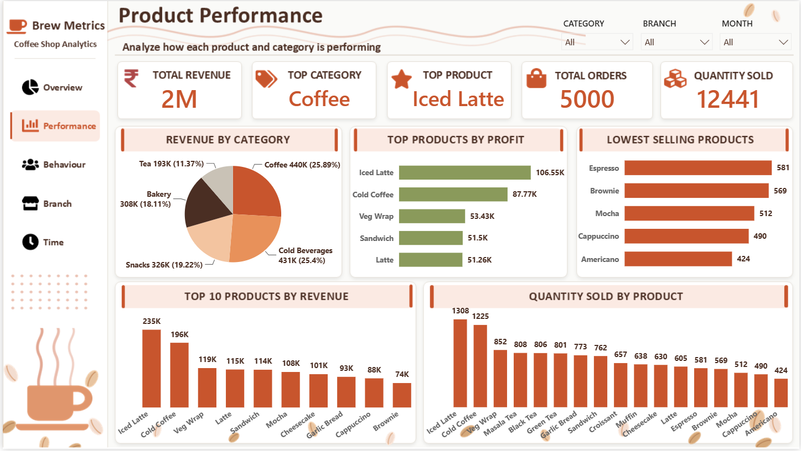
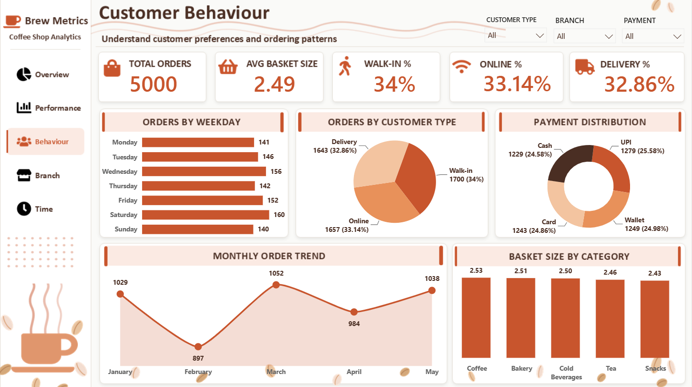
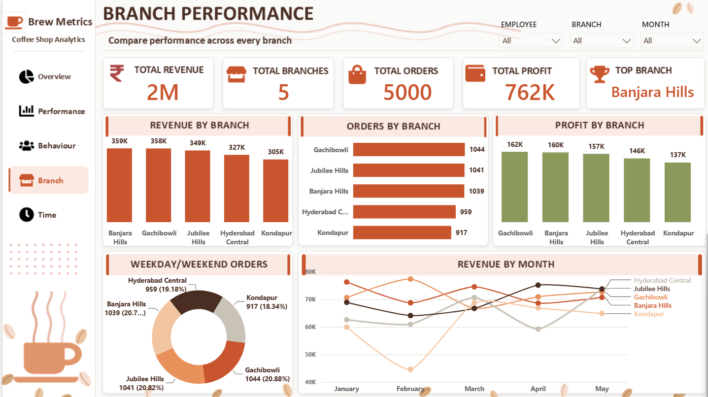

# Brew Metric — Coffee Shop Analytics 


> **Self-Made Project** | Project 12  
> A 7-page interactive Power BI dashboard for a fictional coffee shop chain — **Brew Metric** — built on a custom PowerPoint-designed background with a warm Mocha Minimal theme. Covers 5,000 orders across 5 branches and 17 products from January to May 2024.

---

## Project Overview

This project analyzes coffee shop sales, product performance, customer behaviour, branch efficiency, and time-based trends for **Brew Metric Coffee Shop Analytics**. The dashboard features a custom-designed background built in PowerPoint, a fully branded navigation page, and an advanced **Quick Analysis** page that lets users toggle between 6 metrics and 9 dimensions dynamically.

**Key business questions answered:**
- Which branches and products drive the most revenue and profit?
- What are customer ordering patterns — walk-in vs online vs delivery?
- Which payment methods do customers prefer?
- What time of day, day of week, and month drives peak sales?
- How do all metrics compare across every dimension dynamically?

---

## Tools Used

| Tool | Purpose |
|------|---------|
| **Power BI** | 7-page interactive dashboard with dynamic metric/dimension selectors |
| **PowerPoint** | Custom background design for all 7 dashboard pages — Mocha Minimal theme |

---

## Dashboard Pages

### Page 1 — Landing / Navigation


### Page 2 — Executive Overview


### Page 3 — Product Performance


### Page 4 — Customer Behaviour


### Page 5 — Branch Performance


### Page 6 — Time Analysis


### Page 7 — Quick Analysis


---

## Key Business Insights

### Overall KPIs
| Metric | Value |
|--------|-------|
| Total Sales | ₹2M |
| Total Orders | 5,000 |
| Total Profit | ₹7,61,960 |
| Avg Order Value | ₹339.67 |
| Profit Margin | 44.87% |
| Total Quantity Sold | 12,441 |
| Total Branches | 5 |
| Total Products | 17 |
| Data Period | Jan – May 2024 |

### Branch Performance
| Branch | Revenue | Orders | Profit |
|--------|---------|--------|--------|
| Banjara Hills | 359K | 1,039 | 160K |
| Gachibowli | 358K | 1,044 | 162K — Top Profit |
| Jubilee Hills | 349K | 1,041 | 157K |
| Hyderabad Central | 327K | 959 | 146K |
| Kondapur | 305K | 917 | 137K |

- **Banjara Hills** leads in revenue (359K) — confirmed **Top Branch**
- **Gachibowli** leads in profit (162K) despite slightly lower revenue
- **Kondapur** is the lowest performing branch in both revenue and orders

### Product Performance
| Product | Revenue | Profit |
|---------|---------|--------|
| Iced Latte | 235K | 1,06,550 — Top |
| Cold Coffee | 196K | 87,770 |
| Veg Wrap | 119K | 53,430 |
| Latte | 115K | 51,260 |
| Sandwich | 114K | 51,500 |

- **Iced Latte** is the top product by both revenue and profit
- **Coffee** is the top category at 440K (25.89%)
- **Cold Beverages** is 2nd at 431K (25.4%) — almost equal to Coffee
- **Lowest selling** products: Americano (424), Cappuccino (490), Mocha (512)

### Customer Behaviour
| Channel | Orders | Percentage |
|---------|--------|------------|
| Walk-in | 1,700 | 34% |
| Online | 1,657 | 33.14% |
| Delivery | 1,643 | 32.86% |

- All 3 channels are **almost perfectly balanced** — 34% / 33% / 33%
- **Avg Basket Size: 2.49** items per order
- **Saturday (160 orders)** is the busiest day
- **Sunday (140)** is the slowest day
- **February (897 orders)** — lowest month | **March (1,052)** — highest month

### Payment Distribution
| Payment | Orders | Percentage |
|---------|--------|------------|
| UPI | 1,279 | 25.58% |
| Cash | 1,229 | 24.58% |
| Card | 1,243 | 24.86% |
| Wallet | 1,249 | 24.98% |

- All 4 payment modes are **nearly equally distributed** — no single dominant method
- UPI leads slightly at 25.58%

### Time Analysis
| Metric | Value |
|--------|-------|
| Peak Hour | 22 (10 PM) |
| Peak Day | Wednesday |
| Morning Revenue | 531K (31.26%) — highest time slot |
| Afternoon Revenue | 520K (30.61%) |
| Evening Revenue | 425K (25%) |
| Night Revenue | 223K (13.12%) |
| Weekday Revenue | 1,224K (72.08%) |
| Weekend Revenue | 474K (27.92%) |

- **Morning** is the peak time slot — coffee culture strongest in mornings
- **Wednesday** is the busiest day (255K revenue) tied with Tuesday
- **May** is the highest revenue month (356K), **February** the lowest (316K)
- Weekdays account for **72.08%** of total revenue

### Quick Analysis Page
- **6 Metrics:** Total Sales, Total Profit, Total Orders, Total Quantity, Avg Order Value, Profit Margin %
- **9 Dimensions:** Branch, Category, Product, Customer Type, Payment Mode, Day, Time of Day, Weekend/Weekday, Month
- Every chart updates **instantly** when metric or dimension is selected
- This makes the page act like **54 different charts in one** (6 × 9)

---

## Project Structure

```
12_Coffee-Shop-Analytics/
│
├── README.md                              ← You are here
│
├── raw-data/
│   └── README.md
│
├── powerbi/
│   ├── BrewMetric_Coffee_Analytics.pbix   ← Power BI 7-page dashboard
│   └── README.md
│
├── background/
│   ├── BrewMetric_Background.pptx         ← PowerPoint custom backgrounds
│   └── README.md
│
└── Screenshots/
    ├── C1.png                             ← Landing / Navigation page
    ├── C2.png                             ← Executive Overview
    ├── C3.png                             ← Product Performance
    ├── C4.png                             ← Customer Behaviour
    ├── C5.png                             ← Branch Performance
    ├── C6.png                             ← Time Analysis
    └── C7.png                             ← Quick Analysis
```

---

## Dataset

| Property | Value |
|----------|-------|
| **Source** | Self-created Coffee Shop dataset |
| **Period** | January – May 2024 |
| **Total Records** | 5,000 orders |
| **Branches** | 5 (Banjara Hills, Gachibowli, Jubilee Hills, Hyderabad Central, Kondapur) |
| **Products** | 17 |
| **Categories** | Coffee, Cold Beverages, Snacks, Bakery, Tea |
| **Key Fields** | Order ID, Branch, Product Name, Category, Quantity, Sales, Profit, Customer Type, Payment Mode, Order Date, Time of Day, Day, Month |

---

## Design Details

| Element | Details |
|---------|---------|
| **Theme Name** | Mocha Minimal |
| **Background Tool** | Microsoft PowerPoint |
| **Primary Color** | Burnt Orange / Terracotta (#C45C26) |
| **Secondary Color** | Warm Beige / Cream |
| **Accent Color** | Olive Green (for profit visuals) |
| **Font Style** | Clean sans-serif — professional and readable |
| **Branding** | Custom coffee cup logo, wave dividers, coffee bean decorations |
| **Navigation** | 6-card landing page with click-to-navigate buttons |

---

## Author

**Piyush Dave**  
Data Analyst | SQL · Power BI · Tableau · Excel · Python

[](https://www.linkedin.com/in/piyush-dave-0980a03a8)
[](https://public.tableau.com/app/profile/piyushdave/vizzes)
[](https://github.com/PiyushDave30)
